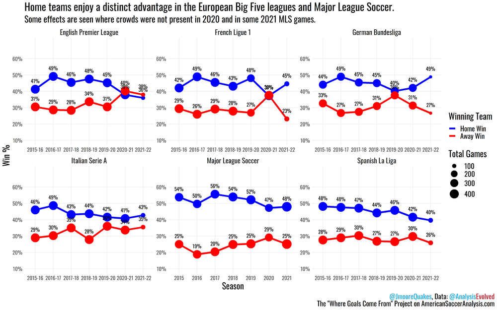

## Background
This is an analysis of homefield advantage in Major League Soccer using Bayesian inference techniques learned in Prof. Ryan Wesslen's Spring 2022 Statistics Masters Course at UNC-Charlotte. 

This post owes a substantial debt of gratitude to Tyler Burch, currently an analyst for the Boston Red Sox. [His original work using Bayesian techniques to identify homefield advantage in Major League Baseball](http://tylerjamesburch.com/blog/baseball/homefield-2020) serves as the inspiration for this analysis. 

To follow along with Tyler (and to see where I got the idea for a number of coding techniques) check out his [code available here](https://github.com/tjburch/mlb-homefield-modeling). 

Where insightful, I will specifically call out parallels to Tyler's work. 

## Introduction

There has been a substantial amount written about homefield advantage in sports and soccer generally. The consensus holds that it [exists in some capacity in sports generally](https://bookshop.org/books/scorecasting-the-hidden-influences-behind-how-sports-are-played-and-games-are-won/9780307591807). 

In the world of soccer specifically, it seems to be [trending downward in recent years... ](https://twitter.com/etmckinley/status/1171805397881110529?s=20&t=GZeVupBMcG6emgmHej2VXg)  

However, certain studies have found it remains [especially pronounced in MLS...](https://www.americansocceranalysis.com/home/2021/11/30/how-away-teams-win-in-mls-and-how-to-be-like-them)  

Despite the accepted body of work out there analyzing homefield advantage, I was not able to find a Bayesian analysis of the concept in MLS specifically. 

Alex Andorra, a co-founder of PyMC Labs, gave a terrific presentation to our course this semester. In it, he highlighted some of the reasons to prefer a Bayesian approach to a classical/frequentist approach: 

I think three of Alex's points stand out as we attempt to ascertain homefield advantage in MLS:

1. "Not a Simple Prediction Problem"
  + Rather, determining homefield advantage is the result of determining the interaction of many complex variables
  
2. "Uncertainty Plays an Important Role"
  + Not only are we uncertain of homefield advantage's very existence, we are also uncertain as to the effect at  a game, team and season level. 
  
3. "Integrate Domain Knowledge Into Models"
  + Selfish but true - I'm a massive sports fan, and I think that area expertise can help immensely here. 
  
  
Ultimately, Bayesian inference provides a posterior distribution of a treatment's effect.  This approach, which is flexible and accounts for many possible "worlds" that could have caused our data, makes it the optimal solution for our question: What is the degree of homefield advantage in MLS? 

## Methodology

We'll answer this question by determining a "goal advantage" just like Tyler did in his MLB study. In other words, "how many more goals we can expect from a home team compared to an away team" in Major League Soccer?

We'll start by creating a generalized linear model to predict the goal output of a team in a given game. Included in this model (among many other parameters) will be one for some underlying “true home-field advantage". If we properly identify and create the DAG for the realization of goal output in a given game (more on that below), then the goal advantage in each game would thus be simply a realization of a random sample of this homefield advantage parameter. 

The outcome variable of “goals” is a count value which means it must be modeled with a discrete distribution since it only takes on integer values. Per Tyler's recommendation, I've used a negative binomial (or gamma-Poisson) distribution to model this variable. 

The key difference between a negative binomial distribution and a Poisson distribution is that the former incorporates two variables (mean and variance) whereas a Poison distribution
implies that the mean is equal to the variance. This makes the negative binomial distribution more flexible especially in those cases where the mean does not equal the variance and is "overdispersed" - in other words, the variance is higher than the mean. 

Next, let's assume the mean of the negative binomial comes from the log of a linear function with 6 predictors. Assume the scoring in a game is impacted by 6 sources:

Si - Team's strength

Oi - Opponent's strength

Gi - Team game 'importance'

OGi - Opponent game 'importance'

Hi - Homefield advantage

τSTADIUM[i] - Field-specific effects for each individual stadium

This is how I conceptualize that model in DAG form: 

```{r echo=FALSE, message=FALSE}
library(dagitty)
library(ggdag)
library(ggplot2)

dag1 <- dagitty('dag {
bb="0,0,1,1"
"τStd[i]" [adjusted,pos="0.482,0.405"]
Gi [exposure,pos="0.238,0.405"]
Goals [outcome,pos="0.355,0.311"]
Hi [exposure,pos="0.499,0.255"]
OGi [exposure,pos="0.358,0.489"]
Oi [exposure,pos="0.214,0.292"]
Si [exposure,pos="0.348,0.182"]
"τStd[i]" -> Hi
Gi -> Goals
Hi -> Goals
OGi -> Goals
Oi -> Goals
Si -> Goals
}

')
#ggdag(dag1, layout = "circle") + ggdag::theme_dag_gray()

ggdag_parents(dag1, 'Goals') + theme_dag_blank()
```

Goal output is a function of observed Si, Oi, Gi, and OGi. Origins of those are explained below. 

Goal output is also a function of observed homefield advantage, which itself is a function of stadium effects (and we adjust for these stadium effects by including it in the model). 

Summary: 

+ Exposure(s): Gi,Hi,OGi,Oi,Si, τStd[i]

+ Outcome(s): Goals

+ Causal paths: 5

## Data Acquisition
All data is taken from 538's club soccer prediction database [outlined here](https://fivethirtyeight.com/methodology/how-our-club-soccer-predictions-work/) and [stored here](https://projects.fivethirtyeight.com/soccer-api/club/spi_matches.csv). 

Si and Oi (strength of teams) will be 538's SPI ratings, defined as the percentage of available points — a win is worth 3 points, a tie worth 1 point, and a loss worth 0 points — the team would be expected to take against an average team on a neutral field. 

Gi and OGi (game importance for teams) are 538's game importance scores. These are defined as "how much the outcome of the match will change each team’s statistical outlook on the season" in terms of accomplishing various goals - making the playoffs, winning the conference, etc. 

While the individuality of each MLS stadium (dimensions, quirks, etc) is not present to the same extent as in MLB, there do exist different field environments across the league (NYCFC playing on a narrow field at Yankee Stadium vs. Atlanta United playing on a perfect turf field at MB Arena). The model controls for that by adding a categorical intercept for each individual stadium, τSTADIUM[i].

Further model specifications - including priors and the variance/gamma distribution parameter - are discussed in  detail below. 

## Cleaning the Data

```{r load-libraries, echo = FALSE, message=FALSE}
library(tidyverse)
library(lubridate)
library(ggplot2)
library(rethinking)
library(dagitty)
library(superml)
library(data.table)
library(knitr)
```

To start, let's get the data from 538 as outlined above: 
```{r Get Data, Filter to MLS 2017 - 2021}
#spi_matches.csv contains match-by-match SPI ratings and forecasts back to 2016.
soccer_df = read.csv('https://projects.fivethirtyeight.com/soccer-api/club/spi_matches.csv') 

#Filter for MLS data from 2017 - 2021 and create a new DF
MLS_data = soccer_df %>% filter(league == 'Major League Soccer') %>% filter(between(season,2017,2021))
```

Let's check the composition and structure of that DF: 

```{r Check Structure, Clean Data}
kable(head(MLS_data),caption = 'Initial MLS Data')
```

Currently the data is in a game by game format, with home and away data for that game stored in the same row  with column names like Var1/Var2 corresponding to home and away, respectively. Ultimately, we will want our data on a team-game level, where each observation is a team's output in a given game (and thus will yield two observations per game, one for the home team and one for the away team). 


```{r}
str(MLS_data)
```

As for the structure, most columns look to be in the right format. 

To be safe, let's do a little bit of cleaning. 

```{r Check Structure, Clean Data2}
#Don't need league ID or league as we know it's MLS
MLS_data = MLS_data %>% select(-c(league_id,league))

#Remove any row with an NA, no matter where the NA is
MLS_data = MLS_data[complete.cases(MLS_data),]

#Convert the date column to date format using Lubridate package
MLS_data$date = lubridate::as_date(MLS_data$date)
```


Here's how those changes affected the DF: 
```{r}
str(MLS_data)
```

We went from  2016 observations of  23 variables to 1970 observations of  21 variables.

Next, let's set up the encoder that will allow for easy conversion of the unique values in the team column team to useful categorical variables. We'll return to this shortly. 
```{r Set Up Home Encoder}
label <- LabelEncoder$new() #create a new encoder environment called "label"
label$fit(MLS_data$team1) #fit the encoder to create one number per level/unique value of the Team1 column
```

## Data Manipulation

To start, let's make the DF for home teams. Much of this is taken from Tyler's workflow. I standardize the numeric treatment variables using the rethinking package's standardize function. 

```{r Make Home DF}
first_season = as.numeric(min(MLS_data$season)) #create the minimum season for our database

home_df = MLS_data %>% select(season) #create dataframe to start and include just season (essentially blank)

home_df$season_seq = home_df$season - first_season #note Tyler calls this simply 'season', to avoid confusion I'm calling this season sequence

home_df$score = MLS_data$score1 #home team final score in match

home_df$spi = standardize(MLS_data$spi1) #home team strength entering match 

home_df$opponent_spi = standardize(MLS_data$spi2) #away (opponent) strength entering match (Tyler uses opponent pitcher strength)

home_df$importance = standardize(MLS_data$importance1) #home match importance (new variable I include)

home_df$opponent_importance = standardize(MLS_data$importance2) #away (opponent) match importance (new variable I include)

home_df$team_string = MLS_data$team1 #home team name

home_df$team = label$transform(MLS_data$team1) #home team encoded value

home_df$stadium = label$transform(MLS_data$team1) #host stadium encoded value

home_df$home = TRUE #Home team
```

Here's the Home DF: 

```{r}
kable(head(home_df),caption = 'Home Data')
```

Now, the same for the Away DF: 

```{r Make Away DF}
away_df = MLS_data %>% select(season) #create dataframe to start and include just season (essentially blank)

away_df$season_seq = away_df$season - first_season #note Tyler calls this simply 'season', to avoid confusion I'm calling this season sequence

away_df$score = MLS_data$score2 #away team final score in match

away_df$spi = standardize(MLS_data$spi2) #away team strength entering match  

away_df$opponent_spi = standardize(MLS_data$spi1) #home (opponent) strength entering match (Tyler uses opponent pitcher strength)

away_df$importance = standardize(MLS_data$importance2) #away team match importance (new variable I include)

away_df$opponent_importance = standardize(MLS_data$importance1) #home (opponent) team match importance (new variable I include)

away_df$team_string = MLS_data$team2 #away team name

away_df$team = label$transform(MLS_data$team2) #away team encoded value

away_df$stadium = label$transform(MLS_data$team1) # host stadium encoded value

away_df$home = FALSE #away team
```

Here's the Away DF: 

```{r}
kable(head(away_df),caption = 'Away Data')
```

Note a few key syntax differences to account for away team data being stored in columns that end in "___2" in the original MLS_data DF:

- We are using the values from the team2 variable in the original MLS_data DF to create the away team using previous encodings

- We are using the values from the team1 variable in the original MLS_data DF to create the host stadium using previous encodings

- Boolean "home" is all false

Considering those encodings are complicated, let's test to make sure they worked correctly in each DF:
```{r test the encodings worked}
test_1 = home_df %>% group_by(team_string) %>% summarise(mean(team)) #Should be Constant value ---> Take Mean
test_2 = away_df %>% group_by(team_string) %>% summarise(mean(team)) #Should be Constant value ---> Take Mean
test_3 = cbind(test_1,test_2) #Combine the two test DFs
test_3 #print the DF as a sanity check
```

Good news: each team has the same encoding in the respective DFs. 

Now, let's join the two DFs together to create our master DF: 

```{r Join for Final_DF}
final_df = rbind(home_df,away_df) #can row bind because the column length is the same
kable(head(final_df),caption = 'Final Data')
```

```{r}
str(final_df)
```

Per Tyler's recommendation, let's save home team as a boolean value, 1 for home and 0 for away, and  team and stadium (the home team in any given matchup, which is encoded into the index ranging from 0 to 26) as an integer. 

```{r Final Manipulation}
final_df$home = as.integer(final_df$home) 
final_df$team = as.integer(final_df$team)
final_df$stadium = as.integer(final_df$stadium)
str(final_df)
```

And last, one final check to make sure home teams have the same encoded team value and stadium value:
```{r blah}
test_4 = final_df %>% filter(home == 1) %>% mutate(check = team - stadium) 
head(test_4)
summary(test_4$check)
```

Check column is all 0s...

**Let's get Bayesian'in!**


## Model 0: Prior Sanity Check

Before we get too far along in our model, let's use a very simple, intercept-only model across all seasons to get some sensible priors. 

This means we would model goals scored by a team as a negative binomial distribution with parameters mu and gamma, where the log(mu) equals alpha. We thus need priors for Alpha and Gamma. 

For alpha:

```{r include=FALSE}
MP = function(mu,dev) {
  exp(mu+dev*dev/2)
}
```

```{r}
curve(dlnorm(x,0,10), from = 0, to = 10 ,n = 200) #huge spike at zero, long tail, mean is too big ,mean = impossibly large (see page 349)
MP(0,10)


curve(dlnorm(x,0,1), from = 0, to = 10,n = 200) #decent spike around 1 goals, that makes sense, tail is probably a little too long, mean = 1.648721 (see page 349)
MP(0,1)


curve(dlnorm(x,1,1), from = 0, to = 10,n = 200) #spike closer to 2 goals, tail is better but probably too large, mean = 4.481689, too much
MP(1,1)


curve(dlnorm(x,0.5,0.5), from = 0, to = 10,n = 200) #this mean is 1.86 but I like the shape of the distro more than say 0,0.5
MP(0.5,0.5)

```

For gamma: Larger gamma means the distribution is more similar to a pure poisson. It doesn't feel like goals should have the same mean and variance like in a pure poisson, so let's aim for lower gamma.

```{r}
curve(dunif(x,0,10), from  = 0, to = 10, n = 200) #Tyler's prior, mean is  going to be 5


curve(dexp(x,1),from = 0, to = 10, n = 200) #mean is inverse of rate, so 1 / 1 = 1


curve(dexp(x,.5),from = 0, to = 10, n = 200) #mean is inverse of rate, so 1 / .5 = 2


curve(dexp(x,2),from = 0, to = 10, n = 200) #mean is inverse of rate, so 1 / 2 = .5


curve(dexp(x,5),from = 0, to = 10, n = 200) #mean is inverse of rate, so 1 / 5 = .2


```

On visual feel alone, alpha ~ Normal (0.5, 0.5) and gamma ~ Exponential (2) feel right. 

There are programs out there (including one developed by Alex and PyMC Labs) that make prior selection intuitive by translating gut feels of experts into the statistical frameworks. Future work should incorporate these helper functions. 


Now, just to make sure, let's fit the simplest model: 
```{r eval=FALSE}
dat <- list(
  Goals = final_df$score)
  
m0 = ulam(
  alist(
    Goals ~ dgampois(mu,gamma),
    log(mu) <- alpha,
    alpha ~ dnorm(0.5,0.5),
    gamma ~ dexp(2)
  ) , data = dat, chains = 4, log_lik = TRUE)

```

And now we can load the model for a simple sanity check - we're just using this for priors.
```{r}
m0 = readRDS("./m0.rds")
```


Sanity Check
```{r message=FALSE}
set.seed(1999)

m0_priors = extract.prior(m0, n = 10000)
```


```{r}
pAlpha = exp(m0_priors$alpha)
dens(pAlpha,adj = 0.1)
mean(pAlpha) #Mean of 1.86
```


```{r}
pGamma = m0_priors$gamma
dens(pGamma,adj = 0.1)
mean(pGamma) #Mean of .5
```

Our priors thus suggest we expect goals to be distributed with a neg binomial with a mean/rate of 1.86 per team / per match and dispersion of 0.5 across cases. Research online suggests [roughly 1.3 - 1.9 goals per game is reasonable](https://www.soccerstats.com/table.asp?league=england&tid=d), so this looks fair to me to start. 

## Model 1: Simple 2021 Model

Now that we've got a few priors  anchored, let's pick an initial model. Let's keep the model nice and easy as a proof of concept too as we'll check the posterior and convergence very quickly before moving on to bigger fish.

We'll use just 2021 data and use a pared-down version of our bigger model, this one with just two IV: Team strength and opponent strength. We'll assume these are the only ways in which goal output is determined in a match. 

First, let's grab the relevant data:

```{r}
model_1_df = final_df %>% filter(season == 2021) %>% 
  select(c(season,score,spi,opponent_spi,team_string,team))

kable(head(model_1_df),caption = 'Model 1 Data')
```

For the sake of completeness, our initial model will look like this:

Goals ~ NegativeBinomial (Mu, Gamma): Goals are distributed via a negative binomial distribution with rate mu and dispersion/scale/spread gamma. 

Log(mu) = Alpha + Beta1(Si) + Beta2(Oi): the average of goals in game of given team strength and opponent strength is a generalized linear model in which the log of mu is a sum of an intercept, the team strength coefficient and the opponent strength coefficient where the following priors are distributed: 

We know two of our priors: 

Alpha ~ Normal (0.5, 0.5) : See above

Gamma ~ Exponential (2) : See above

But what about team strength and opponent strength? 

We've standardized these values in the model already, so let's make sure that when we exponentionate, we don't create too dramatic of an effect.

Let's go with 0 and .25 for mean and standard deviation of both team strength and opponent strength coefficients to start (suggesting a one st. dev increase in team strength would probably lead to a 1 goal advantage, as we would exponentiate a value relatively close to 0). 

Fit the model: 
```{r eval=FALSE}
dat <- list(
  Goals = model_1_df$score,
  Team_Str = model_1_df$spi,
  Opp_Str = model_1_df$opponent_spi)
  
m1.1 = ulam(
  alist(
    Goals ~ dgampois(mu,gamma),
    log(mu) <- alpha + B1*Team_Str + B2*Opp_Str,
    alpha ~ dnorm(0.5,0.5),
    B1 ~ dnorm(0,.25),
    B2 ~ dnorm (0,.25),
    gamma ~ dexp(2)
  ) , data = dat, chains = 4) # See page 334. You would include if you wanted to calculate for each observed outcome the log-probability of it occurring You can find it within extract.samples(clean = FALSE)
```


Load the model:
```{r}
m1.1 = readRDS("./m1.1.rds")
```


We know the priors make sense in a vacuum, but how about their interactions together?

First, let's grab the priors:

```{r message=FALSE}
#Grab priors
set.seed(1999)

m1.1_priors = extract.prior(m1.1, n = 10000)
```

Now, let's see what the average looks like on the outcome scale:
```{r}
#Mu priors, need to convert to the outcome scale
pMu = exp(m1.1_priors$alpha + m1.1_priors$B1 + m1.1_priors$B2)
dens(pMu,adj = 0.1)
mean(pMu) #1.972

```

In thinking about this model, we should expect the average goals scored by a team to be roughly 1.97. Seems ok to me, especially in light of the long-run average of goals scored being roughly 1.3 - 1.75. This might be a little high though, and we might be able to do better down the road! 

In looking at the prior differences between strengths, the prior is concentrated on low absolute differences.

```{r}
#prior difference between strengths
pTeam = exp(m1.1_priors$B1)
pOpp = exp(m1.1_priors$B2)
dens(abs(pTeam - pOpp), adj = 0.1)
mean(abs(pTeam - pOpp)) #mean is 0.289
#prior is concentrated on low absolute differences

```

This is saying that the effect team strength would have on the expected goals in a game is slightly higher (but not that much higher) than the effect opponent strength would have on the expected goals in a game. Maybe the effect is large, but the probability of that is low. All things considered, this seems sensible.

Let's check on our gamma prior too. Here, we do not need to exponentiate because the gamma prior exists outside the log function.
```{r}
#gamma prior: 
pGamma = m1.1_priors$gamma
dens(pGamma,adj = 0.1)
mean(pGamma)
```

The spread of goals across prior cases is roughly 0.5, which we calculated before. 

Moving to the posterior quickly, let's first check the convergence diagnostics, which seem healthy. We see the "fuzzy caterpillar" for most of the variables in the  trace plots and the trankplot shows a fair bit of back and forth.

```{r}
traceplot(m1.1, pars = c('alpha','B1', 'B2','gamma'), n_cols = 2, window = c(500,1000))

trankplot(m1.1, pars = c('alpha','B1', 'B2','gamma'), n_cols = 2, window = c(500,1000))

par(mfrow = c(1, 1))
```

In the model itself, we see a Rhat of 1 and a high number of effective samples. 
```{r}
precis(m1.1, depth = 2)
```

Here, let's quickly examine the posterior effect of team strength vs. opponent strength:
```{r}
post = extract.samples(m1.1)
diff_p <- exp(post$B1) - exp(post$B2)
dens( diff_p, lwd=4, col=2, xlab="Team-Opp contrast (total)")
abline( v=0, lty=3)
mean(diff_p)
```

It's a little lower now, with a mean of just .2 compared to a prior of roughly .289, but it remains in the same ballpark. 

Note this is not a true posterior check because we are considering each parameter separately. 

To do a quick and dirty posterior check, let's use the postcheck function.

Here's an example from our basic model: 


The vertical axis shows the predicted goals for each case on the horizontal. 

The blue points show the empirical goals scored for each case. 

The open circle are the posterior mean goals at the 89th percentile interval. 

The + symbols mark the 89% of predicted goals. 

A lot of dispersion is necessarily expected with a simple model. We can see the model also does not like extreme outcomes as the posterior mean goals are nearly all 2 or less. 

That's ok, however, as we'll see below that more robust models can handle this in a superior way. 

## Model 2: More Complex 2021 Model

Now that we've established a somewhat sensible model to predict goal output in a game, let's layer in some additional variables. Using just 2021 data still, let's add in the game importance variables for each team as well as the homefield advantage and stadium variables. 

```{r}
model_2_df = final_df %>% filter(season == 2021) %>% 
  select(c(season,score,spi,opponent_spi,importance, opponent_importance, stadium, home, team_string,team))

kable(head(model_2_df),caption = 'Model 2 Data')
```

For the sake of completeness, our initial model will look like this:

Goals ~ NegativeBinomial (Mu, Gamma): Goals are distributed via a negative binomial distribution with rate mu and dispersion/scale/spread gamma. 

Log(mu) = Alpha + Beta1(Si) + Beta2(Oi) + Beta3(Gi) + Beta4(OGi) + Beta5(Hi) + τStd[i]: the average of goals in a game of given team strength, opponent strength, game importance, opponent game importance, homefield advantage and stadium effects is a generalized linear model in which the log of mu is a sum of an intercept and the relevant coefficients where the following priors are distributed: 

Alpha ~ Normal (0.5, 0.5) : See above.

Beta1 ~ Normal (0, 0.25) : See above.

Beta2 ~ Normal (0, 0.25): See above.

Beta3 ~ Normal (0,0.1) : Same logic as above as variable has been standardized, however effect is suspected to be less important.

Beta4 ~ Normal (0,0.1) : Same logic as above as variable has been standardized, however effect is suspected to be less important.

Binary Homefield  ~ Normal (0,0.5) : Homefield advantage, which we're looking to ascertain. Let's keep it very wide to start. 

τStd[i] ~ Normal (0,0.1) : Assumed effect of each stadium is equal in this prior and not very large.

Gamma ~ Exponential (2) : See above.


Fit the model: 
```{r eval=FALSE}
dat2 <- list(
  Goals = model_2_df$score,
  Team_Str = model_2_df$spi,
  Opp_Str = model_2_df$opponent_spi,
  Team_Imp = model_2_df$importance,
  Opp_Imp = model_2_df$opponent_importance,
  Homefield = model_2_df$home + 1,
  Stadium = model_2_df$stadium + 1)
  
m2 = ulam(
  alist(
    Goals ~ dgampois(mu,gamma),
    log(mu) <- alpha + B1*Team_Str + B2*Opp_Str + B3*Team_Imp + B4*Opp_Imp + q[Homefield] + z[Stadium],
    alpha ~ dnorm(0.5,0.5),
    B1 ~ dnorm(0,.25),
    B2 ~ dnorm (0,.25),
    B3 ~ dnorm(0,0.1),
    B4 ~ dnorm(0,0.1),
    q[Homefield] ~ dnorm(0,0.5),
    z[Stadium] ~ dnorm (0,0.1),
    gamma ~ dexp(2)
  ) , data = dat2, chains = 4) 
```

Load the model: 
```{r}
m2 = readRDS("./m2.rds")
```


Prior check: 

```{r message=FALSE}
set.seed(1999)

m2_priors <- extract.prior(m2, n=1e4)
```

Now we'll run the prior predictive simulation.

```{r}
# prior for home
pH <- exp( m2_priors$q[,2])
dens(pH, adj=0.1, xlab="Prior Home Goal Effect")
```

```{r}
# prior for away
pA<- exp( m2_priors$q[,1])
dens(pA, adj=0.1, xlab="Prior Away Goal Effect")
```

```{r}
dens(abs(pH - pA), xlab = "Absolute Prior Differences, H - A")
mean(abs(pH - pA)) #.62
```

The priors we get for home and away make sense as there should not be too much separating them, which would indicate homefield advantage is weak. We said as much when we set them both equal to Normal (0,0.5). 

Paraphrasing from Richard McElreath's "Statistical Rethinking" book, page 329:

"While a difference of 0 or essentially nothing in terms of homefield has the highest prior probability (this makes sense considering we did not differentiate between home and away effect just yet), the average prior difference is about .62 goals. Extremely large differences are less plausible. However this is not a strong prior. If the data contain evidence of large differences, they will shine through. We want our priors to be skeptical of large differences, so that we reduce overfitting." 


Now let's analyze the model further.

All coefficients (of varying levels of usefulness) are displayed here: 

```{r}
precis(m2, depth = 2)
```


As for our convergence, these look good once again. 

```{r}
traceplot(m2,pars = c('alpha','B1','B2','B3','B4','q[1]','q[2]'), n_cols = 2, ask = FALSE, window = c(500,1000))

trankplot(m2,pars = c('alpha','B1','B2','B3','B4','q[1]','q[2]'), n_cols = 2, ask = FALSE, window = c(500,1000))

par(mfrow = c(1, 1))
```


Now for a big test. Let's plot the posterior distribution of goals and make sure it looks like something we could reasonably see in the real world. 

First, let's simulate from the samples. 

```{r}
set.seed(2000)
sim.goals = sim(m2)

#each row is a sample from the posterior
#is column is a row in the data

mean(sim.goals) #1.392
```

Ok, 1.39 goals as the average - we can definitely work with that! 

Now, let's plot the "raw" posterior. In other words, this is the distribution of all simulated goals scored by teams from the data. 
```{r}
#raw posterior
sim.goals.count = data.frame(table(sim.goals))

plot = ggplot(data = sim.goals.count,aes(x = sim.goals,y = Freq, group =1))
plot + geom_point(shape=21, color="black", fill="#69b3a2", size=6) + geom_line(color = 'grey') + theme_classic() + scale_y_continuous(labels = scales::comma) + xlab("Simulated Goals for Team") + ylab("Games in Posterior") 
```

This lets us see how that 1.39 goals average was distributed. Indeed, it looks like a negative binomial to me. The peak above 0 is textbook negative binomial. 

But to make sure it really looks right, let's scale it to the same amount of games as the data in question (just 2021 here) and compare the real world to simulated data. 

```{r}
#scaled posterior for comparison
sim.goals.elements = sum(sim.goals.count$Freq)

sim.goals.count$sim.goals.scaled = (sim.goals.count$Freq/sim.goals.elements)*nrow(model_2_df)


goals_seq = seq(0,max(as.integer(sim.goals.count$sim.goals)))
goals_seq = data.frame(goals_seq)
goals_seq$goals_seq = as.factor(goals_seq$goals_seq)
goals_seq = left_join(goals_seq,sim.goals.count, by = c('goals_seq' = 'sim.goals'))
actual_goals_freq = model_2_df %>% count(score)
actual_goals_freq$score = as.factor(actual_goals_freq$score)
goals_seq = left_join(goals_seq,actual_goals_freq,by = c('goals_seq' ='score'))
goals_seq[is.na(goals_seq)] <- 0


plot2= ggplot(data = goals_seq,aes(x = goals_seq))
colors <- c("Sim" = "gold", "Actuals" = "black")

plot2 + geom_point(aes(y = sim.goals.scaled,color = "Sim",group = 1), size = 6) + geom_line(aes(y = sim.goals.scaled, group = 1), color = 'grey') + geom_point(aes(y = n, color = "Actuals", group = 1), size = 4, alpha = 0.95) + theme_classic() + scale_color_manual(values = colors) + xlab("(Simulated) Goals for Team") + ylab("Games in (Simulated) Season") + labs(colour = "Season Type") + labs(title = "Posterior Predictive Check", subtitle = "Simulated Season v. Actual Season", caption = "2021 Season")
```

Our simulated model looks a little more aggressive in picking some highly unlikely scores (including some double digit games) but all in all, this model looks alright. 

Of course, we're after homefield advantage. So let's plot the contrast between home and away team effect!
```{r}
post_2 = extract.samples(m2)

#posterior for home
postH <- exp( post_2$q[,2])
dens(postH, adj=0.1, xlab="Post Home Goal Effect", show.HPDI = .89)

#posterior for away
postA <- exp( post_2$q[,1])
dens(postA, adj=0.1, xlab="Post Away Goal Effect", show.HPDI = .89)

#Contrast plot
dens(postH - postA, xlab = "Post Differences, H - A", show.HPDI = .89, show.zero = T)
mean(postH - postA) #.35 goals
```


```{r}
#contrast Stats
post_2$hfa = postH - postA 
precis(post_2,depth = 2) #to see it all laid out

#then specifically
precis( list( postH=postH , postA=postA, hfa = post_2$hfa))
plot(precis( list( postH=postH , postA=postA, hfa = post_2$hfa)))
```

We see 2021's homefield advantage (according to our model) is somewhere in the .2 to .5 goals per game range. Not overly substantial, but certainly non-negligible. 

## Model 3: Complex Model All Seasons

Ok! so we see that HFA is reasonably in the .2 to .5 goals range in 2021. How about a model that considers all seasons, from 2017 to 2021? 

Let's load the data: 

```{r}
model_3_df = final_df %>% 
  select(c(season,score,spi,opponent_spi,importance, opponent_importance, stadium, home, team_string,team))

kable(head(model_3_df),caption = 'Model 3 Data')
```

And let's build that third model. All priors are the same as model 2, outlined above. 

```{r eval=FALSE}
dat3 <- list(
  Goals = model_3_df$score,
  Team_Str = model_3_df$spi,
  Opp_Str = model_3_df$opponent_spi,
  Team_Imp = model_3_df$importance,
  Opp_Imp = model_3_df$opponent_importance,
  Homefield = model_3_df$home + 1,
  Stadium = model_3_df$stadium + 1)
  
m3 = ulam(
  alist(
    Goals ~ dgampois(mu,gamma),
    log(mu) <- alpha + B1*Team_Str + B2*Opp_Str + B3*Team_Imp + B4*Opp_Imp + q[Homefield] + z[Stadium],
    alpha ~ dnorm(0.5,0.5),
    B1 ~ dnorm(0,.25),
    B2 ~ dnorm (0,.25),
    B3 ~ dnorm(0,0.1),
    B4 ~ dnorm(0,0.1),
    q[Homefield] ~ dnorm(0,0.5),
    z[Stadium] ~ dnorm (0,0.1),
    gamma ~ dexp(2)
  ) , data = dat3, chains = 4) 
```

Load the model: 
```{r}
m3 = readRDS("./m3.rds")
```

As we've already gotten pretty comfortable with our priors, let's get right into analyzing. 

```{r}
precis(m3, depth = 2)
```


Once more, the model has converged. 

```{r}
traceplot(m3,pars = c('alpha','B1','B2','B3','B4','q[1]','q[2]'), n_cols = 2, ask = FALSE, window = c(500,1000))

trankplot(m3,pars = c('alpha','B1','B2','B3','B4','q[1]','q[2]'), n_cols = 2, ask = FALSE, window = c(500,1000))

par(mfrow = c(1, 1)) 
```

Plot posterior distribution of goals, does it make sense? 

```{r}
set.seed(2000)
sim.goals3 = sim(m3)
#each row is a sample from the posterior
#is column is a row in the data

mean(sim.goals3) #1.4789
```

Now we see our average predicted goals has increased slightly to 1.48 per team per game. Let's visualize that distribution both raw:
```{r}
sim.goals.count3 = data.frame(table(sim.goals3))

#raw posterior
plot3 = ggplot(data = sim.goals.count3,aes(x = sim.goals3,y = Freq, group =1))
plot3 + geom_point(shape=21, color="black", fill="#69b3a2", size=6) + geom_line(color = 'grey') + theme_classic() + scale_y_continuous(labels = scales::comma) + xlab("Simulated Goals for Team") + ylab("Games in Posterior") 
```

and scaled: 
```{r}
#scaled posterior for comparison
sim.goals.elements3 = sum(sim.goals.count3$Freq)

sim.goals.count3$sim.goals.scaled = (sim.goals.count3$Freq/sim.goals.elements3)*nrow(model_3_df)


goals_seq3 = seq(0,max(as.integer(sim.goals.count3$sim.goals3)))
goals_seq3 = data.frame(goals_seq3)
goals_seq3$goals_seq3 = as.factor(goals_seq3$goals_seq3)
goals_seq3 = left_join(goals_seq3,sim.goals.count3, by = c('goals_seq3' = 'sim.goals3'))
actual_goals_freq3 = model_3_df %>% count(score)
actual_goals_freq3$score = as.factor(actual_goals_freq3$score)
goals_seq3 = left_join(goals_seq3,actual_goals_freq3,by = c('goals_seq3' ='score'))
goals_seq3[is.na(goals_seq3)] <- 0


plot3= ggplot(data = goals_seq3,aes(x = goals_seq3))
colors <- c("Sim" = "gold", "Actuals" = "black")

plot3 + geom_point(aes(y = sim.goals.scaled,color = "Sim",group = 1), size = 6) + geom_line(aes(y = sim.goals.scaled, group = 1), color = 'grey') + geom_point(aes(y = n, color = "Actuals", group = 1), size = 4, alpha = 0.95) + theme_classic() + scale_color_manual(values = colors) + xlab("(Simulated) Goals for Team") + ylab("Games in (Simulated) Season") + labs(colour = "Season Type") + labs(title = "Posterior Predictive Check", subtitle = "Simulated Seasons v. Actual Seasons", caption = "2017 - 2021 Seasons")
```

Very interesting to note that we can see the simulated and actual goal counts becoming much more similar. An example of pooling, perhaps? 

AS for the contrast: 
```{r}
post_3 = extract.samples(m3)

#posterior for home
postH3 <- exp( post_3$q[,2])
dens(postH3, adj=0.1, xlab="Post Home Goal Effect", show.HPDI = .89)

#posterior for away
postA3 <- exp( post_3$q[,1])
dens(postA3, adj=0.1, xlab="Post Away Goal Effect", show.HPDI = .89)

#Contrast plot
dens(postH3 - postA3, xlab =  "Post Differences, H - A", show.HPDI = .89, show.zero = T)
mean(postH3 - postA3) #.39 goals

#contrast Stats
post_3$hfa = postH3 - postA3 
precis(post_3,depth = 2) #to see it all laid out

#then specifically
precis( list( postH3=postH3 , postA3=postA3, hfa = post_3$hfa))

plot(precis( list( postH3=postH3 , postA3=postA3, hfa = post_3$hfa)))
```

Again, we see the HFA is roughly in the .25 - .6 range per game when incorporating all seasons. 


## HFA in Each Season

So to quickly wrap this up, let's calculate the homefield advantage via the same contrast method for each of the 4 seasons we did not consider individually (2017 - 2020). 

Below we'll create the function to grab the model for each year quickly. 

```{r echo=FALSE}
season_year_model = function(season_year) {
  
  season_df = final_df %>% filter(season == season_year) %>% 
  select(c(season,score,spi,opponent_spi,importance, opponent_importance, stadium, home, team_string,team))
  
  data <- list(
  Goals = season_df$score,
  Team_Str = season_df$spi,
  Opp_Str = season_df$opponent_spi,
  Team_Imp = season_df$importance,
  Opp_Imp = season_df$opponent_importance,
  Homefield = season_df$home + 1,
  Stadium = season_df$stadium + 1)

model_year <<- ulam(
  alist(
    Goals ~ dgampois(mu,gamma),
    log(mu) <- alpha + B1*Team_Str + B2*Opp_Str + B3*Team_Imp + B4*Opp_Imp + q[Homefield] + z[Stadium],
    alpha ~ dnorm(0.5,0.5),
    B1 ~ dnorm(0,.25),
    B2 ~ dnorm (0,.25),
    B3 ~ dnorm(0,0.1),
    B4 ~ dnorm(0,0.1),
    q[Homefield] ~ dnorm(0,0.5),
    z[Stadium] ~ dnorm (0,0.1),
    gamma ~ dexp(2)
  ) , data = data, chains = 4) 

}
```


```{r eval=FALSE}
for (i in c(2017,2018,2019,2020)) {
  season_year_model(i)
  
  assign(
    paste0("year_",i,"_model"),
    model_year)
    
  remove(model_year)
}
```

Now, let's load each of them: 
```{r}
#load models
model_2017 = readRDS("./2017model.rds")
model_2018 = readRDS("./2018model.rds")
model_2019 = readRDS("./2019model.rds")
model_2020 = readRDS("./2020model.rds")
```

And let's plot the contrasts in homefield advantage as we've been doing:

2017
```{r}
#2017
post2017 = extract.samples(model_2017)
postH2017 = exp(post2017$q[,2])
postA2017 = exp(post2017$q[,1])
dens(postH2017 - postA2017, xlab ="Post Differences, H - A", show.HPDI = .89, show.zero = T)
mean(postH2017 - postA2017) #.53 goals
post2017$hfa=postH2017-postA2017
precis( list( postH2017=postH2017 , postA2017=postA2017, hfa = post2017$hfa))
plot(precis( list( postH2017=postH2017 , postA2017=postA2017, hfa = post2017$hfa)))
```

2018
```{r}
#2018
post2018 = extract.samples(model_2018)
postH2018 = exp(post2018$q[,2])
postA2018 = exp(post2018$q[,1])
dens(postH2018 - postA2018, xlab ="Post Differences, H - A", show.HPDI = .89, show.zero = T)
mean(postH2018 - postA2018) #.44 goals
post2018$hfa=postH2018-postA2018
precis( list( postH2018=postH2018 , postA2018=postA2018, hfa = post2018$hfa))
plot(precis( list( postH2018=postH2018 , postA2018=postA2018, hfa = post2018$hfa)))
```

2019
```{r}
post2019 = extract.samples(model_2019)
postH2019 = exp(post2019$q[,2])
postA2019 = exp(post2019$q[,1])
dens(postH2019 - postA2019, xlab ="Post Differences, H - A", show.HPDI = .89, show.zero = T)
mean(postH2019 - postA2019) #.34 goals
post2019$hfa=postH2019-postA2019
precis( list( postH2019=postH2019 , postA2019=postA2019, hfa = post2019$hfa))
plot(precis( list( postH2019=postH2019 , postA2019=postA2019, hfa = post2019$hfa)))
```

2020
```{r}
post2020 = extract.samples(model_2020)
postH2020 = exp(post2020$q[,2])
postA2020 = exp(post2020$q[,1])
dens(postH2020- postA2020, xlab ="Post Differences, H - A", show.HPDI = .89, show.zero = T)
mean(postH2020 - postA2020) #.29 goals
post2020$hfa=postH2020-postA2020
precis( list( postH2020=postH2020 , postA2020=postA2020, hfa = post2020$hfa))
plot(precis( list( postH2020=postH2020 , postA2020=postA2020, hfa = post2020$hfa)))
```


Now let's bring it all together in one precis table and plot: 
```{r}
precis( list( 
  hfa2017 = post2017$hfa,
  hfa2018 = post2018$hfa,
  hfa2019 = post2019$hfa,
  hfa2020 = post2020$hfa,
  hfa2021 = post_2$hfa,
  hfa_joint = post_3$hfa
))

plot(precis( list( 
  hfa2017 = post2017$hfa,
  hfa2018 = post2018$hfa,
  hfa2019 = post2019$hfa,
  hfa2020 = post2020$hfa,
  hfa2021 = post_2$hfa,
  hfa_joint = post_3$hfa
)))
```

From the above, I believe we can reasonably conclude homefield advantage exists in MLS, likely in the neighborhood of .2 - .5 goals per game for the home team!


## Summary

A few interesting things stand out looking at the above homefield advantage inference trends. 

The first is that homefield advantage seems to decreases as the years go on, most notably to its lowest predicted level in 2020. This makes sense.  2020 was the heart of sports-during-COVID and the concept of a home team was loose, with teams either playing in front of mostly empty stadiums or playing in entirely new venues. 

Secondly, in a reassuring validity check there is no negative HFA predicted in the 89% interval. 2020 comes the closes, with 89th percentile HPDI touching .14. This is important because I would hesitate to think many people - sports fans or not - would suggest it's likely that homefield advantage either does not exist or actually works in REVERSE to well-held common belief. 

Third, HPDI widths actually go down as the seasons go on. 2017 has a 89th percentile HPDI width of .56, whereas 2021 has an 89th percentile HPDI width of .35. My guess is this has to do with the underlying data from 538 getting "better" in terms of more accurate readings that website has been able to make into team strengths, game importance, etc via a refined model. 

All in all, considering so much of the probability distribution lies somewhere in the .2 to .5 range, I would conclude that MLS has a homefield advantage that is non-negligible and worth investigating further.  


## PB Checklist - To Delete
Does it run locally? YES
Does it run in a zip?
Does it knit? YES
Does the notebook make sense? 

## Further Study

I propose a few areas for further study. 

The first is resolving some of the underlying data issues, namely that playoffs are lumped together with regular season games, not all teams had the same level of potential capacity for their home games, and that a number of teams since 2020 have had to play home games in a variety of different stadiums due to local COVID protocols. These issues should be sorted out before ruling definitively on MLS homefield advantage 

The second would be a different DAG. Is Hi unobserved? Do we even need game importance for each team or could we average that out by game? How about weather, time of game and actual attendance figures - would any of those improve the model? 

Additionally, different outcomes could be explored, such as using expected goals (xG) in order to reduce the inherent randomness of the realization of goals.

Finally, some truly exemplary future studies would incorporate multilevel models to reduce overfitting. MLMs could feature more leagues as different clusters both in North American sports and soccer globally. They could also cluster each season and go back farther with the data to get a more nuanced view. 

If one was curious, a possible other data source would be [Jalapic's github repository with massive amounts of historical world soccer data by league](https://github.com/jalapic/engsoccerdata). 

Another possible idea more generally would be to update [Daniel Weitzenfeld's 2014 blog post about Bayesian inference in the Premier League](http://danielweitzenfeld.github.io/passtheroc/blog/2014/10/28/bayes-premier-league/). 

Thanks for reading, please be sure to follow up with any questions you might have. And next time your favorite MLS team ties at home, just know - they likely were spotted a fractional goal to begin with! 

