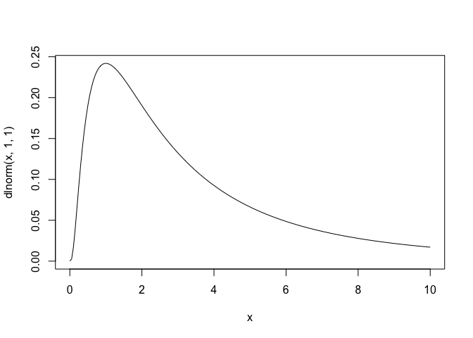
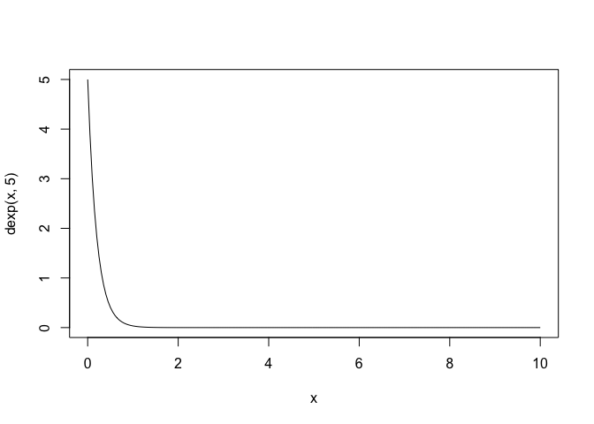

Bayesian Analysis of Major League Soccer Homefield Advantage
================
Peter Barston
5/9/22


## Background

This is an analysis of homefield advantage in Major League Soccer using
Bayesian inference techniques learned in Prof. Ryan Wesslen’s Spring
2022 Statistics Masters Course at UNC-Charlotte.

This post owes a substantial debt of gratitude to Tyler Burch, currently
an analyst for the Boston Red Sox. [His original work using Bayesian
techniques to identify homefield advantage in Major League
Baseball](http://tylerjamesburch.com/blog/baseball/homefield-2020)
serves as the inspiration for this analysis.

To follow along with Tyler (and to see where I got the idea for a number
of coding techniques) check out his [code available
here](https://github.com/tjburch/mlb-homefield-modeling).

Where insightful, I will specifically call out parallels to Tyler’s
work.

## Introduction

There has been a substantial amount written about homefield advantage in
sports and soccer generally. The consensus holds that it [exists in some
capacity in sports
generally](https://bookshop.org/books/scorecasting-the-hidden-influences-behind-how-sports-are-played-and-games-are-won/9780307591807).

In the world of soccer specifically, it seems to be [trending downward
in recent
years…](https://twitter.com/etmckinley/status/1171805397881110529?s=20&t=GZeVupBMcG6emgmHej2VXg)


However, certain studies have found it remains [especially pronounced in
MLS…](https://www.americansocceranalysis.com/home/2021/11/30/how-away-teams-win-in-mls-and-how-to-be-like-them)


Despite the accepted body of work out there analyzing homefield
advantage, I was not able to find a Bayesian analysis of the concept in
MLS specifically.

Alex Andorra, a co-founder of PyMC Labs, gave a terrific presentation to
our course this semester. In it, he highlighted some of the reasons to
prefer a Bayesian approach to a classical/frequentist approach:


I think three of Alex’s points stand out as we attempt to ascertain
homefield advantage in MLS:

1.  “Not a Simple Prediction Problem”

-   Rather, determining homefield advantage is the result of determining
    the interaction of many complex variables

1.  “Uncertainty Plays an Important Role”

-   Not only are we uncertain of homefield advantage’s very existence,
    we are also uncertain as to the effect at a game, team and season
    level.

1.  “Integrate Domain Knowledge Into Models”

-   Selfish but true - I’m a massive sports fan, and I think that area
    expertise can help immensely here.

Ultimately, Bayesian inference provides a posterior distribution of a
treatment’s effect. This approach, which is flexible and accounts for
many possible “worlds” that could have caused our data, makes it the
optimal solution for our question: What is the degree of homefield
advantage in MLS?

## Methodology

We’ll answer this question by determining a “goal advantage” just like
Tyler did in his MLB study. In other words, “how many more goals we can
expect from a home team compared to an away team” in Major League
Soccer?

We’ll start by creating a generalized linear model to predict the goal
output of a team in a given game. Included in this model (among many
other parameters) will be one for some underlying “true home-field
advantage”. If we properly identify and create the DAG for the
realization of goal output in a given game (more on that below), then
the goal advantage in each game would thus be simply a realization of a
random sample of this homefield advantage parameter.

The outcome variable of “goals” is a count value which means it must be
modeled with a discrete distribution since it only takes on integer
values. Per Tyler’s recommendation, I’ve used a negative binomial (or
gamma-Poisson) distribution to model this variable.

The key difference between a negative binomial distribution and a
Poisson distribution is that the former incorporates two variables (mean
and variance) whereas a Poison distribution implies that the mean is
equal to the variance. This makes the negative binomial distribution
more flexible especially in those cases where the mean does not equal
the variance and is “overdispersed” - in other words, the variance is
higher than the mean.

Next, let’s assume the mean of the negative binomial comes from the log
of a linear function with 6 predictors. Assume the scoring in a game is
impacted by 6 sources:

Si - Team’s strength

Oi - Opponent’s strength

Gi - Team game ‘importance’

OGi - Opponent game ‘importance’

Hi - Homefield advantage

τSTADIUM\[i\] - Field-specific effects for each individual stadium

This is how I conceptualize that model in DAG form:

<!-- -->

Goal output is a function of observed Si, Oi, Gi, and OGi. Origins of
those are explained below.

Goal output is also a function of observed homefield advantage, which
itself is a function of stadium effects (and we adjust for these stadium
effects by including it in the model).

Summary:

-   Exposure(s): Gi,Hi,OGi,Oi,Si, τStd\[i\]

-   Outcome(s): Goals

-   Causal paths: 5

## Data Acquisition

All data is taken from 538’s club soccer prediction database [outlined
here](https://fivethirtyeight.com/methodology/how-our-club-soccer-predictions-work/)
and [stored
here](https://projects.fivethirtyeight.com/soccer-api/club/spi_matches.csv).

Si and Oi (strength of teams) will be 538’s SPI ratings, defined as the
percentage of available points — a win is worth 3 points, a tie worth 1
point, and a loss worth 0 points — the team would be expected to take
against an average team on a neutral field.

Gi and OGi (game importance for teams) are 538’s game importance scores.
These are defined as “how much the outcome of the match will change each
team’s statistical outlook on the season” in terms of accomplishing
various goals - making the playoffs, winning the conference, etc.

While the individuality of each MLS stadium (dimensions, quirks, etc) is
not present to the same extent as in MLB, there do exist different field
environments across the league (NYCFC playing on a narrow field at
Yankee Stadium vs. Atlanta United playing on a perfect turf field at MB
Arena). The model controls for that by adding a categorical intercept
for each individual stadium, τSTADIUM\[i\].

Further model specifications - including priors and the variance/gamma
distribution parameter - are discussed in detail below.

## Cleaning the Data

To start, let’s get the data from 538 as outlined above:

``` r
#spi_matches.csv contains match-by-match SPI ratings and forecasts back to 2016.
soccer_df = read.csv('https://projects.fivethirtyeight.com/soccer-api/club/spi_matches.csv') 

#Filter for MLS data from 2017 - 2021 and create a new DF
MLS_data = soccer_df %>% filter(league == 'Major League Soccer') %>% filter(between(season,2017,2021))
```

Let’s check the composition and structure of that DF:

``` r
kable(head(MLS_data),caption = 'Initial MLS Data')
```

| season | date       | league\_id | league              | team1              | team2                  |  spi1 |  spi2 |  prob1 |  prob2 | probtie | proj\_score1 | proj\_score2 | importance1 | importance2 | score1 | score2 |  xg1 |  xg2 | nsxg1 | nsxg2 | adj\_score1 | adj\_score2 |
|-------:|:-----------|-----------:|:--------------------|:-------------------|:-----------------------|------:|------:|-------:|-------:|--------:|-------------:|-------------:|------------:|------------:|-------:|-------:|-----:|-----:|------:|------:|------------:|------------:|
|   2017 | 2017-03-03 |       1951 | Major League Soccer | Portland Timbers   | Minnesota United FC    | 31.44 | 27.19 | 0.5244 | 0.2284 |  0.2472 |         1.79 |         1.08 |        20.4 |        21.1 |      5 |      1 | 2.90 | 0.47 |  1.59 |  1.57 |        3.90 |        1.05 |
|   2017 | 2017-03-04 |       1951 | Major League Soccer | Columbus Crew      | Chicago Fire           | 30.88 | 24.80 | 0.5337 | 0.2338 |  0.2324 |         2.22 |         1.34 |        22.2 |        18.9 |      1 |      1 | 1.62 | 0.74 |  1.55 |  1.01 |        1.05 |        1.05 |
|   2017 | 2017-03-04 |       1951 | Major League Soccer | Los Angeles Galaxy | FC Dallas              | 37.45 | 37.23 | 0.4962 | 0.2385 |  0.2652 |         1.48 |         0.95 |        18.2 |        16.3 |      1 |      2 | 1.59 | 0.41 |  1.50 |  0.70 |        1.05 |        2.10 |
|   2017 | 2017-03-04 |       1951 | Major League Soccer | Real Salt Lake     | Toronto FC             | 26.84 | 44.30 | 0.2834 | 0.4561 |  0.2605 |         1.28 |         1.51 |        17.7 |        13.9 |      0 |      0 | 1.53 | 1.66 |  1.20 |  0.60 |        0.00 |        0.00 |
|   2017 | 2017-03-04 |       1951 | Major League Soccer | Colorado Rapids    | New England Revolution | 28.34 | 31.02 | 0.4945 | 0.2302 |  0.2754 |         1.31 |         0.81 |        20.9 |        21.8 |      1 |      0 | 0.92 | 0.39 |  1.23 |  0.69 |        1.05 |        0.00 |
|   2017 | 2017-03-04 |       1951 | Major League Soccer | DC United          | Sporting Kansas City   | 36.45 | 33.78 | 0.5057 | 0.2478 |  0.2465 |         1.80 |         1.24 |        18.1 |        18.1 |      0 |      0 | 1.59 | 0.64 |  0.98 |  1.21 |        0.00 |        0.00 |

Initial MLS Data

Currently the data is in a game by game format, with home and away data
for that game stored in the same row with column names like Var1/Var2
corresponding to home and away, respectively. Ultimately, we will want
our data on a team-game level, where each observation is a team’s output
in a given game (and thus will yield two observations per game, one for
the home team and one for the away team).

``` r
str(MLS_data)
```

    ## 'data.frame':    2016 obs. of  23 variables:
    ##  $ season     : int  2017 2017 2017 2017 2017 2017 2017 2017 2017 2017 ...
    ##  $ date       : chr  "2017-03-03" "2017-03-04" "2017-03-04" "2017-03-04" ...
    ##  $ league_id  : int  1951 1951 1951 1951 1951 1951 1951 1951 1951 1951 ...
    ##  $ league     : chr  "Major League Soccer" "Major League Soccer" "Major League Soccer" "Major League Soccer" ...
    ##  $ team1      : chr  "Portland Timbers" "Columbus Crew" "Los Angeles Galaxy" "Real Salt Lake" ...
    ##  $ team2      : chr  "Minnesota United FC" "Chicago Fire" "FC Dallas" "Toronto FC" ...
    ##  $ spi1       : num  31.4 30.9 37.5 26.8 28.3 ...
    ##  $ spi2       : num  27.2 24.8 37.2 44.3 31 ...
    ##  $ prob1      : num  0.524 0.534 0.496 0.283 0.494 ...
    ##  $ prob2      : num  0.228 0.234 0.238 0.456 0.23 ...
    ##  $ probtie    : num  0.247 0.232 0.265 0.261 0.275 ...
    ##  $ proj_score1: num  1.79 2.22 1.48 1.28 1.31 1.8 1.1 1.33 2.22 1.34 ...
    ##  $ proj_score2: num  1.08 1.34 0.95 1.51 0.81 1.24 1.13 1.18 1.79 1.54 ...
    ##  $ importance1: num  20.4 22.2 18.2 17.7 20.9 18.1 44.3 15.8 20.5 21.7 ...
    ##  $ importance2: num  21.1 18.9 16.3 13.9 21.8 18.1 86.4 18.2 22.4 12.7 ...
    ##  $ score1     : int  5 1 1 0 1 0 2 1 1 1 ...
    ##  $ score2     : int  1 1 2 0 0 0 1 0 0 2 ...
    ##  $ xg1        : num  2.9 1.62 1.59 1.53 0.92 1.59 1.5 1.52 0.61 1.22 ...
    ##  $ xg2        : num  0.47 0.74 0.41 1.66 0.39 0.64 0.76 0.1 1.31 0.73 ...
    ##  $ nsxg1      : num  1.59 1.55 1.5 1.2 1.23 0.98 1.63 1.72 0.84 0.47 ...
    ##  $ nsxg2      : num  1.57 1.01 0.7 0.6 0.69 1.21 1.47 0.42 1.21 0.88 ...
    ##  $ adj_score1 : num  3.9 1.05 1.05 0 1.05 0 2.1 1.05 1.05 1.05 ...
    ##  $ adj_score2 : num  1.05 1.05 2.1 0 0 0 1.05 0 0 2.1 ...

As for the structure, most columns look to be in the right format.

To be safe, let’s do a little bit of cleaning.

``` r
#Don't need league ID or league as we know it's MLS
MLS_data = MLS_data %>% select(-c(league_id,league))

#Remove any row with an NA, no matter where the NA is
MLS_data = MLS_data[complete.cases(MLS_data),]

#Convert the date column to date format using Lubridate package
MLS_data$date = lubridate::as_date(MLS_data$date)
```

Here’s how those changes affected the DF:

``` r
str(MLS_data)
```

    ## 'data.frame':    1970 obs. of  21 variables:
    ##  $ season     : int  2017 2017 2017 2017 2017 2017 2017 2017 2017 2017 ...
    ##  $ date       : Date, format: "2017-03-03" "2017-03-04" ...
    ##  $ team1      : chr  "Portland Timbers" "Columbus Crew" "Los Angeles Galaxy" "Real Salt Lake" ...
    ##  $ team2      : chr  "Minnesota United FC" "Chicago Fire" "FC Dallas" "Toronto FC" ...
    ##  $ spi1       : num  31.4 30.9 37.5 26.8 28.3 ...
    ##  $ spi2       : num  27.2 24.8 37.2 44.3 31 ...
    ##  $ prob1      : num  0.524 0.534 0.496 0.283 0.494 ...
    ##  $ prob2      : num  0.228 0.234 0.238 0.456 0.23 ...
    ##  $ probtie    : num  0.247 0.232 0.265 0.261 0.275 ...
    ##  $ proj_score1: num  1.79 2.22 1.48 1.28 1.31 1.8 1.1 1.33 2.22 1.34 ...
    ##  $ proj_score2: num  1.08 1.34 0.95 1.51 0.81 1.24 1.13 1.18 1.79 1.54 ...
    ##  $ importance1: num  20.4 22.2 18.2 17.7 20.9 18.1 44.3 15.8 20.5 21.7 ...
    ##  $ importance2: num  21.1 18.9 16.3 13.9 21.8 18.1 86.4 18.2 22.4 12.7 ...
    ##  $ score1     : int  5 1 1 0 1 0 2 1 1 1 ...
    ##  $ score2     : int  1 1 2 0 0 0 1 0 0 2 ...
    ##  $ xg1        : num  2.9 1.62 1.59 1.53 0.92 1.59 1.5 1.52 0.61 1.22 ...
    ##  $ xg2        : num  0.47 0.74 0.41 1.66 0.39 0.64 0.76 0.1 1.31 0.73 ...
    ##  $ nsxg1      : num  1.59 1.55 1.5 1.2 1.23 0.98 1.63 1.72 0.84 0.47 ...
    ##  $ nsxg2      : num  1.57 1.01 0.7 0.6 0.69 1.21 1.47 0.42 1.21 0.88 ...
    ##  $ adj_score1 : num  3.9 1.05 1.05 0 1.05 0 2.1 1.05 1.05 1.05 ...
    ##  $ adj_score2 : num  1.05 1.05 2.1 0 0 0 1.05 0 0 2.1 ...

We went from 2016 observations of 23 variables to 1970 observations of
21 variables.

Next, let’s set up the encoder that will allow for easy conversion of
the unique values in the team column team to useful categorical
variables. We’ll return to this shortly.

``` r
label <- LabelEncoder$new() #create a new encoder environment called "label"
label$fit(MLS_data$team1) #fit the encoder to create one number per level/unique value of the Team1 column
```

## Data Manipulation

To start, let’s make the DF for home teams. Much of this is taken from
Tyler’s workflow. I standardize the numeric treatment variables using
the rethinking package’s standardize function.

``` r
first_season = as.numeric(min(MLS_data$season)) #create the minimum season for our database

home_df = MLS_data %>% select(season) #create dataframe to start and include just season (essentially blank)

home_df$season_seq = home_df$season - first_season #note Tyler calls this simply 'season', to avoid confusion I'm calling this season sequence

home_df$score = MLS_data$score1 #home team final score in match

home_df$spi = standardize(MLS_data$spi1) #home team strength entering match 

home_df$opponent_spi = standardize(MLS_data$spi2) #away (opponent) strength entering match (Tyler uses opponent pitcher strength)

home_df$importance = standardize(MLS_data$importance1) #home match importance (new variable I include)

home_df$opponent_importance = standardize(MLS_data$importance2) #away (opponent) match importance (new variable I include)

home_df$team_string = MLS_data$team1 #home team name

home_df$team = label$transform(MLS_data$team1) #home team encoded value

home_df$stadium = label$transform(MLS_data$team1) #host stadium encoded value

home_df$home = TRUE #Home team
```

Here’s the Home DF:

``` r
kable(head(home_df),caption = 'Home Data')
```

| season | season\_seq | score |        spi | opponent\_spi | importance | opponent\_importance | team\_string       | team | stadium | home |
|-------:|------------:|------:|-----------:|--------------:|-----------:|---------------------:|:-------------------|-----:|--------:|:-----|
|   2017 |           0 |     5 | -0.7751715 |    -1.2988004 | -0.1395405 |           -0.0903473 | Portland Timbers   |    0 |       0 | TRUE |
|   2017 |           0 |     1 | -0.8482807 |    -1.6129134 | -0.0589511 |           -0.1875244 | Columbus Crew      |    1 |       1 | TRUE |
|   2017 |           0 |     1 |  0.0094475 |     0.0207369 | -0.2380386 |           -0.3023700 | Los Angeles Galaxy |    2 |       2 | TRUE |
|   2017 |           0 |     0 | -1.3757118 |     0.9499331 | -0.2604245 |           -0.4083813 | Real Salt Lake     |    3 |       3 | TRUE |
|   2017 |           0 |     1 | -1.1798834 |    -0.7954311 | -0.1171546 |           -0.0594273 | Colorado Rapids    |    4 |       4 | TRUE |
|   2017 |           0 |     0 | -0.1211048 |    -0.4326898 | -0.2425158 |           -0.2228615 | DC United          |    5 |       5 | TRUE |

Home Data

Now, the same for the Away DF:

``` r
away_df = MLS_data %>% select(season) #create dataframe to start and include just season (essentially blank)

away_df$season_seq = away_df$season - first_season #note Tyler calls this simply 'season', to avoid confusion I'm calling this season sequence

away_df$score = MLS_data$score2 #away team final score in match

away_df$spi = standardize(MLS_data$spi2) #away team strength entering match  

away_df$opponent_spi = standardize(MLS_data$spi1) #home (opponent) strength entering match (Tyler uses opponent pitcher strength)

away_df$importance = standardize(MLS_data$importance2) #away team match importance (new variable I include)

away_df$opponent_importance = standardize(MLS_data$importance1) #home (opponent) team match importance (new variable I include)

away_df$team_string = MLS_data$team2 #away team name

away_df$team = label$transform(MLS_data$team2) #away team encoded value

away_df$stadium = label$transform(MLS_data$team1) # host stadium encoded value

away_df$home = FALSE #away team
```

Here’s the Away DF:

``` r
kable(head(away_df),caption = 'Away Data')
```

| season | season\_seq | score |        spi | opponent\_spi | importance | opponent\_importance | team\_string           | team | stadium | home  |
|-------:|------------:|------:|-----------:|--------------:|-----------:|---------------------:|:-----------------------|-----:|--------:|:------|
|   2017 |           0 |     1 | -1.2988004 |    -0.7751715 | -0.0903473 |           -0.1395405 | Minnesota United FC    |   17 |       0 | FALSE |
|   2017 |           0 |     1 | -1.6129134 |    -0.8482807 | -0.1875244 |           -0.0589511 | Chicago Fire           |   11 |       1 | FALSE |
|   2017 |           0 |     2 |  0.0207369 |     0.0094475 | -0.3023700 |           -0.2380386 | FC Dallas              |   18 |       2 | FALSE |
|   2017 |           0 |     0 |  0.9499331 |    -1.3757118 | -0.4083813 |           -0.2604245 | Toronto FC             |   21 |       3 | FALSE |
|   2017 |           0 |     0 | -0.7954311 |    -1.1798834 | -0.0594273 |           -0.1171546 | New England Revolution |   20 |       4 | FALSE |
|   2017 |           0 |     0 | -0.4326898 |    -0.1211048 | -0.2228615 |           -0.2425158 | Sporting Kansas City   |   15 |       5 | FALSE |

Away Data

Note a few key syntax differences to account for away team data being
stored in columns that end in "\_\_\_2" in the original MLS\_data DF:

-   We are using the values from the team2 variable in the original
    MLS\_data DF to create the away team using previous encodings

-   We are using the values from the team1 variable in the original
    MLS\_data DF to create the host stadium using previous encodings

-   Boolean “home” is all false

Considering those encodings are complicated, let’s test to make sure
they worked correctly in each DF:

``` r
test_1 = home_df %>% group_by(team_string) %>% summarise(mean(team)) #Should be Constant value ---> Take Mean
test_2 = away_df %>% group_by(team_string) %>% summarise(mean(team)) #Should be Constant value ---> Take Mean
test_3 = cbind(test_1,test_2) #Combine the two test DFs
test_3 #print the DF as a sanity check
```

    ##               team_string mean(team)            team_string mean(team)
    ## 1       Atlanta United FC          9      Atlanta United FC          9
    ## 2               Austin FC         26              Austin FC         26
    ## 3            Chicago Fire         11           Chicago Fire         11
    ## 4         Colorado Rapids          4        Colorado Rapids          4
    ## 5           Columbus Crew          1          Columbus Crew          1
    ## 6               DC United          5              DC United          5
    ## 7           FC Cincinnati         23          FC Cincinnati         23
    ## 8               FC Dallas         18              FC Dallas         18
    ## 9          Houston Dynamo          6         Houston Dynamo          6
    ## 10         Inter Miami CF         25         Inter Miami CF         25
    ## 11         Los Angeles FC         22         Los Angeles FC         22
    ## 12     Los Angeles Galaxy          2     Los Angeles Galaxy          2
    ## 13    Minnesota United FC         17    Minnesota United FC         17
    ## 14        Montreal Impact         14        Montreal Impact         14
    ## 15           Nashville SC         24           Nashville SC         24
    ## 16 New England Revolution         20 New England Revolution         20
    ## 17       New York City FC         16       New York City FC         16
    ## 18     New York Red Bulls         12     New York Red Bulls         12
    ## 19        Orlando City SC          8        Orlando City SC          8
    ## 20     Philadelphia Union         13     Philadelphia Union         13
    ## 21       Portland Timbers          0       Portland Timbers          0
    ## 22         Real Salt Lake          3         Real Salt Lake          3
    ## 23   San Jose Earthquakes          7   San Jose Earthquakes          7
    ## 24    Seattle Sounders FC         19    Seattle Sounders FC         19
    ## 25   Sporting Kansas City         15   Sporting Kansas City         15
    ## 26             Toronto FC         21             Toronto FC         21
    ## 27    Vancouver Whitecaps         10    Vancouver Whitecaps         10

Good news: each team has the same encoding in the respective DFs.

Now, let’s join the two DFs together to create our master DF:

``` r
final_df = rbind(home_df,away_df) #can row bind because the column length is the same
kable(head(final_df),caption = 'Final Data')
```

| season | season\_seq | score |        spi | opponent\_spi | importance | opponent\_importance | team\_string       | team | stadium | home |
|-------:|------------:|------:|-----------:|--------------:|-----------:|---------------------:|:-------------------|-----:|--------:|:-----|
|   2017 |           0 |     5 | -0.7751715 |    -1.2988004 | -0.1395405 |           -0.0903473 | Portland Timbers   |    0 |       0 | TRUE |
|   2017 |           0 |     1 | -0.8482807 |    -1.6129134 | -0.0589511 |           -0.1875244 | Columbus Crew      |    1 |       1 | TRUE |
|   2017 |           0 |     1 |  0.0094475 |     0.0207369 | -0.2380386 |           -0.3023700 | Los Angeles Galaxy |    2 |       2 | TRUE |
|   2017 |           0 |     0 | -1.3757118 |     0.9499331 | -0.2604245 |           -0.4083813 | Real Salt Lake     |    3 |       3 | TRUE |
|   2017 |           0 |     1 | -1.1798834 |    -0.7954311 | -0.1171546 |           -0.0594273 | Colorado Rapids    |    4 |       4 | TRUE |
|   2017 |           0 |     0 | -0.1211048 |    -0.4326898 | -0.2425158 |           -0.2228615 | DC United          |    5 |       5 | TRUE |

Final Data

``` r
str(final_df)
```

    ## 'data.frame':    3940 obs. of  11 variables:
    ##  $ season             : int  2017 2017 2017 2017 2017 2017 2017 2017 2017 2017 ...
    ##  $ season_seq         : num  0 0 0 0 0 0 0 0 0 0 ...
    ##  $ score              : int  5 1 1 0 1 0 2 1 1 1 ...
    ##  $ spi                : num  -0.77517 -0.84828 0.00945 -1.37571 -1.17988 ...
    ##   ..- attr(*, "scaled:center")= num 37.4
    ##   ..- attr(*, "scaled:scale")= num 7.66
    ##  $ opponent_spi       : num  -1.2988 -1.6129 0.0207 0.9499 -0.7954 ...
    ##   ..- attr(*, "scaled:center")= num 37.1
    ##   ..- attr(*, "scaled:scale")= num 7.61
    ##  $ importance         : num  -0.14 -0.059 -0.238 -0.26 -0.117 ...
    ##   ..- attr(*, "scaled:center")= num 23.5
    ##   ..- attr(*, "scaled:scale")= num 22.3
    ##  $ opponent_importance: num  -0.0903 -0.1875 -0.3024 -0.4084 -0.0594 ...
    ##   ..- attr(*, "scaled:center")= num 23.1
    ##   ..- attr(*, "scaled:scale")= num 22.6
    ##  $ team_string        : chr  "Portland Timbers" "Columbus Crew" "Los Angeles Galaxy" "Real Salt Lake" ...
    ##  $ team               : num  0 1 2 3 4 5 6 7 8 9 ...
    ##  $ stadium            : num  0 1 2 3 4 5 6 7 8 9 ...
    ##  $ home               : logi  TRUE TRUE TRUE TRUE TRUE TRUE ...

Per Tyler’s recommendation, let’s save home team as a boolean value, 1
for home and 0 for away, and team and stadium (the home team in any
given matchup, which is encoded into the index ranging from 0 to 26) as
an integer.

``` r
final_df$home = as.integer(final_df$home) 
final_df$team = as.integer(final_df$team)
final_df$stadium = as.integer(final_df$stadium)
str(final_df)
```

    ## 'data.frame':    3940 obs. of  11 variables:
    ##  $ season             : int  2017 2017 2017 2017 2017 2017 2017 2017 2017 2017 ...
    ##  $ season_seq         : num  0 0 0 0 0 0 0 0 0 0 ...
    ##  $ score              : int  5 1 1 0 1 0 2 1 1 1 ...
    ##  $ spi                : num  -0.77517 -0.84828 0.00945 -1.37571 -1.17988 ...
    ##   ..- attr(*, "scaled:center")= num 37.4
    ##   ..- attr(*, "scaled:scale")= num 7.66
    ##  $ opponent_spi       : num  -1.2988 -1.6129 0.0207 0.9499 -0.7954 ...
    ##   ..- attr(*, "scaled:center")= num 37.1
    ##   ..- attr(*, "scaled:scale")= num 7.61
    ##  $ importance         : num  -0.14 -0.059 -0.238 -0.26 -0.117 ...
    ##   ..- attr(*, "scaled:center")= num 23.5
    ##   ..- attr(*, "scaled:scale")= num 22.3
    ##  $ opponent_importance: num  -0.0903 -0.1875 -0.3024 -0.4084 -0.0594 ...
    ##   ..- attr(*, "scaled:center")= num 23.1
    ##   ..- attr(*, "scaled:scale")= num 22.6
    ##  $ team_string        : chr  "Portland Timbers" "Columbus Crew" "Los Angeles Galaxy" "Real Salt Lake" ...
    ##  $ team               : int  0 1 2 3 4 5 6 7 8 9 ...
    ##  $ stadium            : int  0 1 2 3 4 5 6 7 8 9 ...
    ##  $ home               : int  1 1 1 1 1 1 1 1 1 1 ...

And last, one final check to make sure home teams have the same encoded
team value and stadium value:

``` r
test_4 = final_df %>% filter(home == 1) %>% mutate(check = team - stadium) 
head(test_4)
```

    ##   season season_seq score          spi opponent_spi  importance
    ## 1   2017          0     5 -0.775171490  -1.29880045 -0.13954049
    ## 2   2017          0     1 -0.848280745  -1.61291343 -0.05895113
    ## 3   2017          0     1  0.009447476   0.02073694 -0.23803858
    ## 4   2017          0     0 -1.375711797   0.94993309 -0.26042451
    ## 5   2017          0     1 -1.179883436  -0.79543110 -0.11715455
    ## 6   2017          0     0 -0.121104765  -0.43268975 -0.24251577
    ##   opponent_importance        team_string team stadium home check
    ## 1         -0.09034732   Portland Timbers    0       0    1     0
    ## 2         -0.18752438      Columbus Crew    1       1    1     0
    ## 3         -0.30237001 Los Angeles Galaxy    2       2    1     0
    ## 4         -0.40838135     Real Salt Lake    3       3    1     0
    ## 5         -0.05942734    Colorado Rapids    4       4    1     0
    ## 6         -0.22286150          DC United    5       5    1     0

``` r
summary(test_4$check)
```

    ##    Min. 1st Qu.  Median    Mean 3rd Qu.    Max. 
    ##       0       0       0       0       0       0

Check column is all 0s…

**Let’s get Bayesian’in!**

## Model 0: Prior Sanity Check

Before we get too far along in our model, let’s use a very simple,
intercept-only model across all seasons to get some sensible priors.

This means we would model goals scored by a team as a negative binomial
distribution with parameters mu and gamma, where the log(mu) equals
alpha. We thus need priors for Alpha and Gamma.

For alpha:

``` r
curve(dlnorm(x,0,10), from = 0, to = 10 ,n = 200) #huge spike at zero, long tail, mean is too big ,mean = impossibly large (see page 349)
```

<!-- -->

``` r
MP(0,10)
```

    ## [1] 5.184706e+21

``` r
curve(dlnorm(x,0,1), from = 0, to = 10,n = 200) #decent spike around 1 goals, that makes sense, tail is probably a little too long, mean = 1.648721 (see page 349)
```

<!-- -->

``` r
MP(0,1)
```

    ## [1] 1.648721

``` r
curve(dlnorm(x,1,1), from = 0, to = 10,n = 200) #spike closer to 2 goals, tail is better but probably too large, mean = 4.481689, too much
```

<!-- -->

``` r
MP(1,1)
```

    ## [1] 4.481689

``` r
curve(dlnorm(x,0.5,0.5), from = 0, to = 10,n = 200) #this mean is 1.86 but I like the shape of the distro more than say 0,0.5
```

<!-- -->

``` r
MP(0.5,0.5)
```

    ## [1] 1.868246

For gamma: Larger gamma means the distribution is more similar to a pure
poisson. It doesn’t feel like goals should have the same mean and
variance like in a pure poisson, so let’s aim for lower gamma.

``` r
curve(dunif(x,0,10), from  = 0, to = 10, n = 200) #Tyler's prior, mean is  going to be 5
```

<!-- -->

``` r
curve(dexp(x,1),from = 0, to = 10, n = 200) #mean is inverse of rate, so 1 / 1 = 1
```

<!-- -->

``` r
curve(dexp(x,.5),from = 0, to = 10, n = 200) #mean is inverse of rate, so 1 / .5 = 2
```

<!-- -->

``` r
curve(dexp(x,2),from = 0, to = 10, n = 200) #mean is inverse of rate, so 1 / 2 = .5
```

<!-- -->

``` r
curve(dexp(x,5),from = 0, to = 10, n = 200) #mean is inverse of rate, so 1 / 5 = .2
```

<!-- -->

On visual feel alone, alpha \~ Normal (0.5, 0.5) and gamma \~
Exponential (2) feel right.

There are programs out there (including one developed by Alex and PyMC
Labs) that make prior selection intuitive by translating gut feels of
experts into the statistical frameworks. Future work should incorporate
these helper functions.

Now, just to make sure, let’s fit the simplest model:

``` r
dat <- list(
  Goals = final_df$score)
  
m0 = ulam(
  alist(
    Goals ~ dgampois(mu,gamma),
    log(mu) <- alpha,
    alpha ~ dnorm(0.5,0.5),
    gamma ~ dexp(2)
  ) , data = dat, chains = 4, log_lik = TRUE)
```

And now we can load the model for a simple sanity check - we’re just
using this for priors.

``` r
m0 = readRDS("./m0.rds")
```

Sanity Check

``` r
set.seed(1999)

m0_priors = extract.prior(m0, n = 10000)
```

    ## Running MCMC with 1 chain, with 1 thread(s) per chain...
    ## 
    ## Chain 1 Iteration:     1 / 20000 [  0%]  (Warmup) 
    ## Chain 1 Iteration:   100 / 20000 [  0%]  (Warmup) 
    ## Chain 1 Iteration:   200 / 20000 [  1%]  (Warmup) 
    ## Chain 1 Iteration:   300 / 20000 [  1%]  (Warmup) 
    ## Chain 1 Iteration:   400 / 20000 [  2%]  (Warmup) 
    ## Chain 1 Iteration:   500 / 20000 [  2%]  (Warmup) 
    ## Chain 1 Iteration:   600 / 20000 [  3%]  (Warmup) 
    ## Chain 1 Iteration:   700 / 20000 [  3%]  (Warmup) 
    ## Chain 1 Iteration:   800 / 20000 [  4%]  (Warmup) 
    ## Chain 1 Iteration:   900 / 20000 [  4%]  (Warmup) 
    ## Chain 1 Iteration:  1000 / 20000 [  5%]  (Warmup) 
    ## Chain 1 Iteration:  1100 / 20000 [  5%]  (Warmup) 
    ## Chain 1 Iteration:  1200 / 20000 [  6%]  (Warmup) 
    ## Chain 1 Iteration:  1300 / 20000 [  6%]  (Warmup) 
    ## Chain 1 Iteration:  1400 / 20000 [  7%]  (Warmup) 
    ## Chain 1 Iteration:  1500 / 20000 [  7%]  (Warmup) 
    ## Chain 1 Iteration:  1600 / 20000 [  8%]  (Warmup) 
    ## Chain 1 Iteration:  1700 / 20000 [  8%]  (Warmup) 
    ## Chain 1 Iteration:  1800 / 20000 [  9%]  (Warmup) 
    ## Chain 1 Iteration:  1900 / 20000 [  9%]  (Warmup) 
    ## Chain 1 Iteration:  2000 / 20000 [ 10%]  (Warmup) 
    ## Chain 1 Iteration:  2100 / 20000 [ 10%]  (Warmup) 
    ## Chain 1 Iteration:  2200 / 20000 [ 11%]  (Warmup) 
    ## Chain 1 Iteration:  2300 / 20000 [ 11%]  (Warmup) 
    ## Chain 1 Iteration:  2400 / 20000 [ 12%]  (Warmup) 
    ## Chain 1 Iteration:  2500 / 20000 [ 12%]  (Warmup) 
    ## Chain 1 Iteration:  2600 / 20000 [ 13%]  (Warmup) 
    ## Chain 1 Iteration:  2700 / 20000 [ 13%]  (Warmup) 
    ## Chain 1 Iteration:  2800 / 20000 [ 14%]  (Warmup) 
    ## Chain 1 Iteration:  2900 / 20000 [ 14%]  (Warmup) 
    ## Chain 1 Iteration:  3000 / 20000 [ 15%]  (Warmup) 
    ## Chain 1 Iteration:  3100 / 20000 [ 15%]  (Warmup) 
    ## Chain 1 Iteration:  3200 / 20000 [ 16%]  (Warmup) 
    ## Chain 1 Iteration:  3300 / 20000 [ 16%]  (Warmup) 
    ## Chain 1 Iteration:  3400 / 20000 [ 17%]  (Warmup) 
    ## Chain 1 Iteration:  3500 / 20000 [ 17%]  (Warmup) 
    ## Chain 1 Iteration:  3600 / 20000 [ 18%]  (Warmup) 
    ## Chain 1 Iteration:  3700 / 20000 [ 18%]  (Warmup) 
    ## Chain 1 Iteration:  3800 / 20000 [ 19%]  (Warmup) 
    ## Chain 1 Iteration:  3900 / 20000 [ 19%]  (Warmup) 
    ## Chain 1 Iteration:  4000 / 20000 [ 20%]  (Warmup) 
    ## Chain 1 Iteration:  4100 / 20000 [ 20%]  (Warmup) 
    ## Chain 1 Iteration:  4200 / 20000 [ 21%]  (Warmup) 
    ## Chain 1 Iteration:  4300 / 20000 [ 21%]  (Warmup) 
    ## Chain 1 Iteration:  4400 / 20000 [ 22%]  (Warmup) 
    ## Chain 1 Iteration:  4500 / 20000 [ 22%]  (Warmup) 
    ## Chain 1 Iteration:  4600 / 20000 [ 23%]  (Warmup) 
    ## Chain 1 Iteration:  4700 / 20000 [ 23%]  (Warmup) 
    ## Chain 1 Iteration:  4800 / 20000 [ 24%]  (Warmup) 
    ## Chain 1 Iteration:  4900 / 20000 [ 24%]  (Warmup) 
    ## Chain 1 Iteration:  5000 / 20000 [ 25%]  (Warmup) 
    ## Chain 1 Iteration:  5100 / 20000 [ 25%]  (Warmup) 
    ## Chain 1 Iteration:  5200 / 20000 [ 26%]  (Warmup) 
    ## Chain 1 Iteration:  5300 / 20000 [ 26%]  (Warmup) 
    ## Chain 1 Iteration:  5400 / 20000 [ 27%]  (Warmup) 
    ## Chain 1 Iteration:  5500 / 20000 [ 27%]  (Warmup) 
    ## Chain 1 Iteration:  5600 / 20000 [ 28%]  (Warmup) 
    ## Chain 1 Iteration:  5700 / 20000 [ 28%]  (Warmup) 
    ## Chain 1 Iteration:  5800 / 20000 [ 29%]  (Warmup) 
    ## Chain 1 Iteration:  5900 / 20000 [ 29%]  (Warmup) 
    ## Chain 1 Iteration:  6000 / 20000 [ 30%]  (Warmup) 
    ## Chain 1 Iteration:  6100 / 20000 [ 30%]  (Warmup) 
    ## Chain 1 Iteration:  6200 / 20000 [ 31%]  (Warmup) 
    ## Chain 1 Iteration:  6300 / 20000 [ 31%]  (Warmup) 
    ## Chain 1 Iteration:  6400 / 20000 [ 32%]  (Warmup) 
    ## Chain 1 Iteration:  6500 / 20000 [ 32%]  (Warmup) 
    ## Chain 1 Iteration:  6600 / 20000 [ 33%]  (Warmup) 
    ## Chain 1 Iteration:  6700 / 20000 [ 33%]  (Warmup) 
    ## Chain 1 Iteration:  6800 / 20000 [ 34%]  (Warmup) 
    ## Chain 1 Iteration:  6900 / 20000 [ 34%]  (Warmup) 
    ## Chain 1 Iteration:  7000 / 20000 [ 35%]  (Warmup) 
    ## Chain 1 Iteration:  7100 / 20000 [ 35%]  (Warmup) 
    ## Chain 1 Iteration:  7200 / 20000 [ 36%]  (Warmup) 
    ## Chain 1 Iteration:  7300 / 20000 [ 36%]  (Warmup) 
    ## Chain 1 Iteration:  7400 / 20000 [ 37%]  (Warmup) 
    ## Chain 1 Iteration:  7500 / 20000 [ 37%]  (Warmup) 
    ## Chain 1 Iteration:  7600 / 20000 [ 38%]  (Warmup) 
    ## Chain 1 Iteration:  7700 / 20000 [ 38%]  (Warmup) 
    ## Chain 1 Iteration:  7800 / 20000 [ 39%]  (Warmup) 
    ## Chain 1 Iteration:  7900 / 20000 [ 39%]  (Warmup) 
    ## Chain 1 Iteration:  8000 / 20000 [ 40%]  (Warmup) 
    ## Chain 1 Iteration:  8100 / 20000 [ 40%]  (Warmup) 
    ## Chain 1 Iteration:  8200 / 20000 [ 41%]  (Warmup) 
    ## Chain 1 Iteration:  8300 / 20000 [ 41%]  (Warmup) 
    ## Chain 1 Iteration:  8400 / 20000 [ 42%]  (Warmup) 
    ## Chain 1 Iteration:  8500 / 20000 [ 42%]  (Warmup) 
    ## Chain 1 Iteration:  8600 / 20000 [ 43%]  (Warmup) 
    ## Chain 1 Iteration:  8700 / 20000 [ 43%]  (Warmup) 
    ## Chain 1 Iteration:  8800 / 20000 [ 44%]  (Warmup) 
    ## Chain 1 Iteration:  8900 / 20000 [ 44%]  (Warmup) 
    ## Chain 1 Iteration:  9000 / 20000 [ 45%]  (Warmup) 
    ## Chain 1 Iteration:  9100 / 20000 [ 45%]  (Warmup) 
    ## Chain 1 Iteration:  9200 / 20000 [ 46%]  (Warmup) 
    ## Chain 1 Iteration:  9300 / 20000 [ 46%]  (Warmup) 
    ## Chain 1 Iteration:  9400 / 20000 [ 47%]  (Warmup) 
    ## Chain 1 Iteration:  9500 / 20000 [ 47%]  (Warmup) 
    ## Chain 1 Iteration:  9600 / 20000 [ 48%]  (Warmup) 
    ## Chain 1 Iteration:  9700 / 20000 [ 48%]  (Warmup) 
    ## Chain 1 Iteration:  9800 / 20000 [ 49%]  (Warmup) 
    ## Chain 1 Iteration:  9900 / 20000 [ 49%]  (Warmup) 
    ## Chain 1 Iteration: 10000 / 20000 [ 50%]  (Warmup) 
    ## Chain 1 Iteration: 10001 / 20000 [ 50%]  (Sampling) 
    ## Chain 1 Iteration: 10100 / 20000 [ 50%]  (Sampling) 
    ## Chain 1 Iteration: 10200 / 20000 [ 51%]  (Sampling) 
    ## Chain 1 Iteration: 10300 / 20000 [ 51%]  (Sampling) 
    ## Chain 1 Iteration: 10400 / 20000 [ 52%]  (Sampling) 
    ## Chain 1 Iteration: 10500 / 20000 [ 52%]  (Sampling) 
    ## Chain 1 Iteration: 10600 / 20000 [ 53%]  (Sampling) 
    ## Chain 1 Iteration: 10700 / 20000 [ 53%]  (Sampling) 
    ## Chain 1 Iteration: 10800 / 20000 [ 54%]  (Sampling) 
    ## Chain 1 Iteration: 10900 / 20000 [ 54%]  (Sampling) 
    ## Chain 1 Iteration: 11000 / 20000 [ 55%]  (Sampling) 
    ## Chain 1 Iteration: 11100 / 20000 [ 55%]  (Sampling) 
    ## Chain 1 Iteration: 11200 / 20000 [ 56%]  (Sampling) 
    ## Chain 1 Iteration: 11300 / 20000 [ 56%]  (Sampling) 
    ## Chain 1 Iteration: 11400 / 20000 [ 57%]  (Sampling) 
    ## Chain 1 Iteration: 11500 / 20000 [ 57%]  (Sampling) 
    ## Chain 1 Iteration: 11600 / 20000 [ 58%]  (Sampling) 
    ## Chain 1 Iteration: 11700 / 20000 [ 58%]  (Sampling) 
    ## Chain 1 Iteration: 11800 / 20000 [ 59%]  (Sampling) 
    ## Chain 1 Iteration: 11900 / 20000 [ 59%]  (Sampling) 
    ## Chain 1 Iteration: 12000 / 20000 [ 60%]  (Sampling) 
    ## Chain 1 Iteration: 12100 / 20000 [ 60%]  (Sampling) 
    ## Chain 1 Iteration: 12200 / 20000 [ 61%]  (Sampling) 
    ## Chain 1 Iteration: 12300 / 20000 [ 61%]  (Sampling) 
    ## Chain 1 Iteration: 12400 / 20000 [ 62%]  (Sampling) 
    ## Chain 1 Iteration: 12500 / 20000 [ 62%]  (Sampling) 
    ## Chain 1 Iteration: 12600 / 20000 [ 63%]  (Sampling) 
    ## Chain 1 Iteration: 12700 / 20000 [ 63%]  (Sampling) 
    ## Chain 1 Iteration: 12800 / 20000 [ 64%]  (Sampling) 
    ## Chain 1 Iteration: 12900 / 20000 [ 64%]  (Sampling) 
    ## Chain 1 Iteration: 13000 / 20000 [ 65%]  (Sampling) 
    ## Chain 1 Iteration: 13100 / 20000 [ 65%]  (Sampling) 
    ## Chain 1 Iteration: 13200 / 20000 [ 66%]  (Sampling) 
    ## Chain 1 Iteration: 13300 / 20000 [ 66%]  (Sampling) 
    ## Chain 1 Iteration: 13400 / 20000 [ 67%]  (Sampling) 
    ## Chain 1 Iteration: 13500 / 20000 [ 67%]  (Sampling) 
    ## Chain 1 Iteration: 13600 / 20000 [ 68%]  (Sampling) 
    ## Chain 1 Iteration: 13700 / 20000 [ 68%]  (Sampling) 
    ## Chain 1 Iteration: 13800 / 20000 [ 69%]  (Sampling) 
    ## Chain 1 Iteration: 13900 / 20000 [ 69%]  (Sampling) 
    ## Chain 1 Iteration: 14000 / 20000 [ 70%]  (Sampling) 
    ## Chain 1 Iteration: 14100 / 20000 [ 70%]  (Sampling) 
    ## Chain 1 Iteration: 14200 / 20000 [ 71%]  (Sampling) 
    ## Chain 1 Iteration: 14300 / 20000 [ 71%]  (Sampling) 
    ## Chain 1 Iteration: 14400 / 20000 [ 72%]  (Sampling) 
    ## Chain 1 Iteration: 14500 / 20000 [ 72%]  (Sampling) 
    ## Chain 1 Iteration: 14600 / 20000 [ 73%]  (Sampling) 
    ## Chain 1 Iteration: 14700 / 20000 [ 73%]  (Sampling) 
    ## Chain 1 Iteration: 14800 / 20000 [ 74%]  (Sampling) 
    ## Chain 1 Iteration: 14900 / 20000 [ 74%]  (Sampling) 
    ## Chain 1 Iteration: 15000 / 20000 [ 75%]  (Sampling) 
    ## Chain 1 Iteration: 15100 / 20000 [ 75%]  (Sampling) 
    ## Chain 1 Iteration: 15200 / 20000 [ 76%]  (Sampling) 
    ## Chain 1 Iteration: 15300 / 20000 [ 76%]  (Sampling) 
    ## Chain 1 Iteration: 15400 / 20000 [ 77%]  (Sampling) 
    ## Chain 1 Iteration: 15500 / 20000 [ 77%]  (Sampling) 
    ## Chain 1 Iteration: 15600 / 20000 [ 78%]  (Sampling) 
    ## Chain 1 Iteration: 15700 / 20000 [ 78%]  (Sampling) 
    ## Chain 1 Iteration: 15800 / 20000 [ 79%]  (Sampling) 
    ## Chain 1 Iteration: 15900 / 20000 [ 79%]  (Sampling) 
    ## Chain 1 Iteration: 16000 / 20000 [ 80%]  (Sampling) 
    ## Chain 1 Iteration: 16100 / 20000 [ 80%]  (Sampling) 
    ## Chain 1 Iteration: 16200 / 20000 [ 81%]  (Sampling) 
    ## Chain 1 Iteration: 16300 / 20000 [ 81%]  (Sampling) 
    ## Chain 1 Iteration: 16400 / 20000 [ 82%]  (Sampling) 
    ## Chain 1 Iteration: 16500 / 20000 [ 82%]  (Sampling) 
    ## Chain 1 Iteration: 16600 / 20000 [ 83%]  (Sampling) 
    ## Chain 1 Iteration: 16700 / 20000 [ 83%]  (Sampling) 
    ## Chain 1 Iteration: 16800 / 20000 [ 84%]  (Sampling) 
    ## Chain 1 Iteration: 16900 / 20000 [ 84%]  (Sampling) 
    ## Chain 1 Iteration: 17000 / 20000 [ 85%]  (Sampling) 
    ## Chain 1 Iteration: 17100 / 20000 [ 85%]  (Sampling) 
    ## Chain 1 Iteration: 17200 / 20000 [ 86%]  (Sampling) 
    ## Chain 1 Iteration: 17300 / 20000 [ 86%]  (Sampling) 
    ## Chain 1 Iteration: 17400 / 20000 [ 87%]  (Sampling) 
    ## Chain 1 Iteration: 17500 / 20000 [ 87%]  (Sampling) 
    ## Chain 1 Iteration: 17600 / 20000 [ 88%]  (Sampling) 
    ## Chain 1 Iteration: 17700 / 20000 [ 88%]  (Sampling) 
    ## Chain 1 Iteration: 17800 / 20000 [ 89%]  (Sampling) 
    ## Chain 1 Iteration: 17900 / 20000 [ 89%]  (Sampling) 
    ## Chain 1 Iteration: 18000 / 20000 [ 90%]  (Sampling) 
    ## Chain 1 Iteration: 18100 / 20000 [ 90%]  (Sampling) 
    ## Chain 1 Iteration: 18200 / 20000 [ 91%]  (Sampling) 
    ## Chain 1 Iteration: 18300 / 20000 [ 91%]  (Sampling) 
    ## Chain 1 Iteration: 18400 / 20000 [ 92%]  (Sampling) 
    ## Chain 1 Iteration: 18500 / 20000 [ 92%]  (Sampling) 
    ## Chain 1 Iteration: 18600 / 20000 [ 93%]  (Sampling) 
    ## Chain 1 Iteration: 18700 / 20000 [ 93%]  (Sampling) 
    ## Chain 1 Iteration: 18800 / 20000 [ 94%]  (Sampling) 
    ## Chain 1 Iteration: 18900 / 20000 [ 94%]  (Sampling) 
    ## Chain 1 Iteration: 19000 / 20000 [ 95%]  (Sampling) 
    ## Chain 1 Iteration: 19100 / 20000 [ 95%]  (Sampling) 
    ## Chain 1 Iteration: 19200 / 20000 [ 96%]  (Sampling) 
    ## Chain 1 Iteration: 19300 / 20000 [ 96%]  (Sampling) 
    ## Chain 1 Iteration: 19400 / 20000 [ 97%]  (Sampling) 
    ## Chain 1 Iteration: 19500 / 20000 [ 97%]  (Sampling) 
    ## Chain 1 Iteration: 19600 / 20000 [ 98%]  (Sampling) 
    ## Chain 1 Iteration: 19700 / 20000 [ 98%]  (Sampling) 
    ## Chain 1 Iteration: 19800 / 20000 [ 99%]  (Sampling) 
    ## Chain 1 Iteration: 19900 / 20000 [ 99%]  (Sampling) 
    ## Chain 1 Iteration: 20000 / 20000 [100%]  (Sampling) 
    ## Chain 1 finished in 0.3 seconds.

``` r
pAlpha = exp(m0_priors$alpha)
dens(pAlpha,adj = 0.1)
```

<!-- -->

``` r
mean(pAlpha) #Mean of 1.86
```

    ## [1] 1.855351

``` r
pGamma = m0_priors$gamma
dens(pGamma,adj = 0.1)
```

<!-- -->

``` r
mean(pGamma) #Mean of .5
```

    ## [1] 0.5043096

Our priors thus suggest we expect goals to be distributed with a neg
binomial with a mean/rate of 1.86 per team / per match and dispersion of
0.5 across cases. Research online suggests [roughly 1.3 - 1.9 goals per
game is
reasonable](https://www.soccerstats.com/table.asp?league=england&tid=d),
so this looks fair to me to start.

## Model 1: Simple 2021 Model

Now that we’ve got a few priors anchored, let’s pick an initial model.
Let’s keep the model nice and easy as a proof of concept too as we’ll
check the posterior and convergence very quickly before moving on to
bigger fish.

We’ll use just 2021 data and use a pared-down version of our bigger
model, this one with just two IV: Team strength and opponent strength.
We’ll assume these are the only ways in which goal output is determined
in a match.

First, let’s grab the relevant data:

``` r
model_1_df = final_df %>% filter(season == 2021) %>% 
  select(c(season,score,spi,opponent_spi,team_string,team))

kable(head(model_1_df),caption = 'Model 1 Data')
```

|      | season | score |        spi | opponent\_spi | team\_string        | team |
|:-----|-------:|------:|-----------:|--------------:|:--------------------|-----:|
| 1545 |   2021 |     2 | -0.1406876 |    -0.1790337 | Houston Dynamo      |    6 |
| 1546 |   2021 |     4 |  1.4050509 |     0.5306777 | Seattle Sounders FC |   19 |
| 1547 |   2021 |     4 | -0.9396673 |     0.3414213 | Montreal Impact     |   14 |
| 1548 |   2021 |     0 |  0.4154649 |     0.0443940 | Orlando City SC     |    8 |
| 1549 |   2021 |     2 |  1.7745138 |    -1.2672577 | Los Angeles FC      |   22 |
| 1550 |   2021 |     2 | -1.3352406 |     1.7897582 | DC United           |    5 |

Model 1 Data

For the sake of completeness, our initial model will look like this:

Goals \~ NegativeBinomial (Mu, Gamma): Goals are distributed via a
negative binomial distribution with rate mu and dispersion/scale/spread
gamma.

Log(mu) = Alpha + Beta1(Si) + Beta2(Oi): the average of goals in game of
given team strength and opponent strength is a generalized linear model
in which the log of mu is a sum of an intercept, the team strength
coefficient and the opponent strength coefficient where the following
priors are distributed:

We know two of our priors:

Alpha \~ Normal (0.5, 0.5) : See above

Gamma \~ Exponential (2) : See above

But what about team strength and opponent strength?

We’ve standardized these values in the model already, so let’s make sure
that when we exponentionate, we don’t create too dramatic of an effect.

Let’s go with 0 and .25 for mean and standard deviation of both team
strength and opponent strength coefficients to start (suggesting a one
st. dev increase in team strength would probably lead to a 1 goal
advantage, as we would exponentiate a value relatively close to 0).

Fit the model:

``` r
dat <- list(
  Goals = model_1_df$score,
  Team_Str = model_1_df$spi,
  Opp_Str = model_1_df$opponent_spi)
  
m1.1 = ulam(
  alist(
    Goals ~ dgampois(mu,gamma),
    log(mu) <- alpha + B1*Team_Str + B2*Opp_Str,
    alpha ~ dnorm(0.5,0.5),
    B1 ~ dnorm(0,.25),
    B2 ~ dnorm (0,.25),
    gamma ~ dexp(2)
  ) , data = dat, chains = 4) # See page 334. You would include if you wanted to calculate for each observed outcome the log-probability of it occurring You can find it within extract.samples(clean = FALSE)
```

Load the model:

``` r
m1.1 = readRDS("./m1.1.rds")
```

We know the priors make sense in a vacuum, but how about their
interactions together?

First, let’s grab the priors:

``` r
#Grab priors
set.seed(1999)

m1.1_priors = extract.prior(m1.1, n = 10000)
```

    ## Running MCMC with 1 chain, with 1 thread(s) per chain...
    ## 
    ## Chain 1 Iteration:     1 / 20000 [  0%]  (Warmup) 
    ## Chain 1 Iteration:   100 / 20000 [  0%]  (Warmup) 
    ## Chain 1 Iteration:   200 / 20000 [  1%]  (Warmup) 
    ## Chain 1 Iteration:   300 / 20000 [  1%]  (Warmup) 
    ## Chain 1 Iteration:   400 / 20000 [  2%]  (Warmup) 
    ## Chain 1 Iteration:   500 / 20000 [  2%]  (Warmup) 
    ## Chain 1 Iteration:   600 / 20000 [  3%]  (Warmup) 
    ## Chain 1 Iteration:   700 / 20000 [  3%]  (Warmup) 
    ## Chain 1 Iteration:   800 / 20000 [  4%]  (Warmup) 
    ## Chain 1 Iteration:   900 / 20000 [  4%]  (Warmup) 
    ## Chain 1 Iteration:  1000 / 20000 [  5%]  (Warmup) 
    ## Chain 1 Iteration:  1100 / 20000 [  5%]  (Warmup) 
    ## Chain 1 Iteration:  1200 / 20000 [  6%]  (Warmup) 
    ## Chain 1 Iteration:  1300 / 20000 [  6%]  (Warmup) 
    ## Chain 1 Iteration:  1400 / 20000 [  7%]  (Warmup) 
    ## Chain 1 Iteration:  1500 / 20000 [  7%]  (Warmup) 
    ## Chain 1 Iteration:  1600 / 20000 [  8%]  (Warmup) 
    ## Chain 1 Iteration:  1700 / 20000 [  8%]  (Warmup) 
    ## Chain 1 Iteration:  1800 / 20000 [  9%]  (Warmup) 
    ## Chain 1 Iteration:  1900 / 20000 [  9%]  (Warmup) 
    ## Chain 1 Iteration:  2000 / 20000 [ 10%]  (Warmup) 
    ## Chain 1 Iteration:  2100 / 20000 [ 10%]  (Warmup) 
    ## Chain 1 Iteration:  2200 / 20000 [ 11%]  (Warmup) 
    ## Chain 1 Iteration:  2300 / 20000 [ 11%]  (Warmup) 
    ## Chain 1 Iteration:  2400 / 20000 [ 12%]  (Warmup) 
    ## Chain 1 Iteration:  2500 / 20000 [ 12%]  (Warmup) 
    ## Chain 1 Iteration:  2600 / 20000 [ 13%]  (Warmup) 
    ## Chain 1 Iteration:  2700 / 20000 [ 13%]  (Warmup) 
    ## Chain 1 Iteration:  2800 / 20000 [ 14%]  (Warmup) 
    ## Chain 1 Iteration:  2900 / 20000 [ 14%]  (Warmup) 
    ## Chain 1 Iteration:  3000 / 20000 [ 15%]  (Warmup) 
    ## Chain 1 Iteration:  3100 / 20000 [ 15%]  (Warmup) 
    ## Chain 1 Iteration:  3200 / 20000 [ 16%]  (Warmup) 
    ## Chain 1 Iteration:  3300 / 20000 [ 16%]  (Warmup) 
    ## Chain 1 Iteration:  3400 / 20000 [ 17%]  (Warmup) 
    ## Chain 1 Iteration:  3500 / 20000 [ 17%]  (Warmup) 
    ## Chain 1 Iteration:  3600 / 20000 [ 18%]  (Warmup) 
    ## Chain 1 Iteration:  3700 / 20000 [ 18%]  (Warmup) 
    ## Chain 1 Iteration:  3800 / 20000 [ 19%]  (Warmup) 
    ## Chain 1 Iteration:  3900 / 20000 [ 19%]  (Warmup) 
    ## Chain 1 Iteration:  4000 / 20000 [ 20%]  (Warmup) 
    ## Chain 1 Iteration:  4100 / 20000 [ 20%]  (Warmup) 
    ## Chain 1 Iteration:  4200 / 20000 [ 21%]  (Warmup) 
    ## Chain 1 Iteration:  4300 / 20000 [ 21%]  (Warmup) 
    ## Chain 1 Iteration:  4400 / 20000 [ 22%]  (Warmup) 
    ## Chain 1 Iteration:  4500 / 20000 [ 22%]  (Warmup) 
    ## Chain 1 Iteration:  4600 / 20000 [ 23%]  (Warmup) 
    ## Chain 1 Iteration:  4700 / 20000 [ 23%]  (Warmup) 
    ## Chain 1 Iteration:  4800 / 20000 [ 24%]  (Warmup) 
    ## Chain 1 Iteration:  4900 / 20000 [ 24%]  (Warmup) 
    ## Chain 1 Iteration:  5000 / 20000 [ 25%]  (Warmup) 
    ## Chain 1 Iteration:  5100 / 20000 [ 25%]  (Warmup) 
    ## Chain 1 Iteration:  5200 / 20000 [ 26%]  (Warmup) 
    ## Chain 1 Iteration:  5300 / 20000 [ 26%]  (Warmup) 
    ## Chain 1 Iteration:  5400 / 20000 [ 27%]  (Warmup) 
    ## Chain 1 Iteration:  5500 / 20000 [ 27%]  (Warmup) 
    ## Chain 1 Iteration:  5600 / 20000 [ 28%]  (Warmup) 
    ## Chain 1 Iteration:  5700 / 20000 [ 28%]  (Warmup) 
    ## Chain 1 Iteration:  5800 / 20000 [ 29%]  (Warmup) 
    ## Chain 1 Iteration:  5900 / 20000 [ 29%]  (Warmup) 
    ## Chain 1 Iteration:  6000 / 20000 [ 30%]  (Warmup) 
    ## Chain 1 Iteration:  6100 / 20000 [ 30%]  (Warmup) 
    ## Chain 1 Iteration:  6200 / 20000 [ 31%]  (Warmup) 
    ## Chain 1 Iteration:  6300 / 20000 [ 31%]  (Warmup) 
    ## Chain 1 Iteration:  6400 / 20000 [ 32%]  (Warmup) 
    ## Chain 1 Iteration:  6500 / 20000 [ 32%]  (Warmup) 
    ## Chain 1 Iteration:  6600 / 20000 [ 33%]  (Warmup) 
    ## Chain 1 Iteration:  6700 / 20000 [ 33%]  (Warmup) 
    ## Chain 1 Iteration:  6800 / 20000 [ 34%]  (Warmup) 
    ## Chain 1 Iteration:  6900 / 20000 [ 34%]  (Warmup) 
    ## Chain 1 Iteration:  7000 / 20000 [ 35%]  (Warmup) 
    ## Chain 1 Iteration:  7100 / 20000 [ 35%]  (Warmup) 
    ## Chain 1 Iteration:  7200 / 20000 [ 36%]  (Warmup) 
    ## Chain 1 Iteration:  7300 / 20000 [ 36%]  (Warmup) 
    ## Chain 1 Iteration:  7400 / 20000 [ 37%]  (Warmup) 
    ## Chain 1 Iteration:  7500 / 20000 [ 37%]  (Warmup) 
    ## Chain 1 Iteration:  7600 / 20000 [ 38%]  (Warmup) 
    ## Chain 1 Iteration:  7700 / 20000 [ 38%]  (Warmup) 
    ## Chain 1 Iteration:  7800 / 20000 [ 39%]  (Warmup) 
    ## Chain 1 Iteration:  7900 / 20000 [ 39%]  (Warmup) 
    ## Chain 1 Iteration:  8000 / 20000 [ 40%]  (Warmup) 
    ## Chain 1 Iteration:  8100 / 20000 [ 40%]  (Warmup) 
    ## Chain 1 Iteration:  8200 / 20000 [ 41%]  (Warmup) 
    ## Chain 1 Iteration:  8300 / 20000 [ 41%]  (Warmup) 
    ## Chain 1 Iteration:  8400 / 20000 [ 42%]  (Warmup) 
    ## Chain 1 Iteration:  8500 / 20000 [ 42%]  (Warmup) 
    ## Chain 1 Iteration:  8600 / 20000 [ 43%]  (Warmup) 
    ## Chain 1 Iteration:  8700 / 20000 [ 43%]  (Warmup) 
    ## Chain 1 Iteration:  8800 / 20000 [ 44%]  (Warmup) 
    ## Chain 1 Iteration:  8900 / 20000 [ 44%]  (Warmup) 
    ## Chain 1 Iteration:  9000 / 20000 [ 45%]  (Warmup) 
    ## Chain 1 Iteration:  9100 / 20000 [ 45%]  (Warmup) 
    ## Chain 1 Iteration:  9200 / 20000 [ 46%]  (Warmup) 
    ## Chain 1 Iteration:  9300 / 20000 [ 46%]  (Warmup) 
    ## Chain 1 Iteration:  9400 / 20000 [ 47%]  (Warmup) 
    ## Chain 1 Iteration:  9500 / 20000 [ 47%]  (Warmup) 
    ## Chain 1 Iteration:  9600 / 20000 [ 48%]  (Warmup) 
    ## Chain 1 Iteration:  9700 / 20000 [ 48%]  (Warmup) 
    ## Chain 1 Iteration:  9800 / 20000 [ 49%]  (Warmup) 
    ## Chain 1 Iteration:  9900 / 20000 [ 49%]  (Warmup) 
    ## Chain 1 Iteration: 10000 / 20000 [ 50%]  (Warmup) 
    ## Chain 1 Iteration: 10001 / 20000 [ 50%]  (Sampling) 
    ## Chain 1 Iteration: 10100 / 20000 [ 50%]  (Sampling) 
    ## Chain 1 Iteration: 10200 / 20000 [ 51%]  (Sampling) 
    ## Chain 1 Iteration: 10300 / 20000 [ 51%]  (Sampling) 
    ## Chain 1 Iteration: 10400 / 20000 [ 52%]  (Sampling) 
    ## Chain 1 Iteration: 10500 / 20000 [ 52%]  (Sampling) 
    ## Chain 1 Iteration: 10600 / 20000 [ 53%]  (Sampling) 
    ## Chain 1 Iteration: 10700 / 20000 [ 53%]  (Sampling) 
    ## Chain 1 Iteration: 10800 / 20000 [ 54%]  (Sampling) 
    ## Chain 1 Iteration: 10900 / 20000 [ 54%]  (Sampling) 
    ## Chain 1 Iteration: 11000 / 20000 [ 55%]  (Sampling) 
    ## Chain 1 Iteration: 11100 / 20000 [ 55%]  (Sampling) 
    ## Chain 1 Iteration: 11200 / 20000 [ 56%]  (Sampling) 
    ## Chain 1 Iteration: 11300 / 20000 [ 56%]  (Sampling) 
    ## Chain 1 Iteration: 11400 / 20000 [ 57%]  (Sampling) 
    ## Chain 1 Iteration: 11500 / 20000 [ 57%]  (Sampling) 
    ## Chain 1 Iteration: 11600 / 20000 [ 58%]  (Sampling) 
    ## Chain 1 Iteration: 11700 / 20000 [ 58%]  (Sampling) 
    ## Chain 1 Iteration: 11800 / 20000 [ 59%]  (Sampling) 
    ## Chain 1 Iteration: 11900 / 20000 [ 59%]  (Sampling) 
    ## Chain 1 Iteration: 12000 / 20000 [ 60%]  (Sampling) 
    ## Chain 1 Iteration: 12100 / 20000 [ 60%]  (Sampling) 
    ## Chain 1 Iteration: 12200 / 20000 [ 61%]  (Sampling) 
    ## Chain 1 Iteration: 12300 / 20000 [ 61%]  (Sampling) 
    ## Chain 1 Iteration: 12400 / 20000 [ 62%]  (Sampling) 
    ## Chain 1 Iteration: 12500 / 20000 [ 62%]  (Sampling) 
    ## Chain 1 Iteration: 12600 / 20000 [ 63%]  (Sampling) 
    ## Chain 1 Iteration: 12700 / 20000 [ 63%]  (Sampling) 
    ## Chain 1 Iteration: 12800 / 20000 [ 64%]  (Sampling) 
    ## Chain 1 Iteration: 12900 / 20000 [ 64%]  (Sampling) 
    ## Chain 1 Iteration: 13000 / 20000 [ 65%]  (Sampling) 
    ## Chain 1 Iteration: 13100 / 20000 [ 65%]  (Sampling) 
    ## Chain 1 Iteration: 13200 / 20000 [ 66%]  (Sampling) 
    ## Chain 1 Iteration: 13300 / 20000 [ 66%]  (Sampling) 
    ## Chain 1 Iteration: 13400 / 20000 [ 67%]  (Sampling) 
    ## Chain 1 Iteration: 13500 / 20000 [ 67%]  (Sampling) 
    ## Chain 1 Iteration: 13600 / 20000 [ 68%]  (Sampling) 
    ## Chain 1 Iteration: 13700 / 20000 [ 68%]  (Sampling) 
    ## Chain 1 Iteration: 13800 / 20000 [ 69%]  (Sampling) 
    ## Chain 1 Iteration: 13900 / 20000 [ 69%]  (Sampling) 
    ## Chain 1 Iteration: 14000 / 20000 [ 70%]  (Sampling) 
    ## Chain 1 Iteration: 14100 / 20000 [ 70%]  (Sampling) 
    ## Chain 1 Iteration: 14200 / 20000 [ 71%]  (Sampling) 
    ## Chain 1 Iteration: 14300 / 20000 [ 71%]  (Sampling) 
    ## Chain 1 Iteration: 14400 / 20000 [ 72%]  (Sampling) 
    ## Chain 1 Iteration: 14500 / 20000 [ 72%]  (Sampling) 
    ## Chain 1 Iteration: 14600 / 20000 [ 73%]  (Sampling) 
    ## Chain 1 Iteration: 14700 / 20000 [ 73%]  (Sampling) 
    ## Chain 1 Iteration: 14800 / 20000 [ 74%]  (Sampling) 
    ## Chain 1 Iteration: 14900 / 20000 [ 74%]  (Sampling) 
    ## Chain 1 Iteration: 15000 / 20000 [ 75%]  (Sampling) 
    ## Chain 1 Iteration: 15100 / 20000 [ 75%]  (Sampling) 
    ## Chain 1 Iteration: 15200 / 20000 [ 76%]  (Sampling) 
    ## Chain 1 Iteration: 15300 / 20000 [ 76%]  (Sampling) 
    ## Chain 1 Iteration: 15400 / 20000 [ 77%]  (Sampling) 
    ## Chain 1 Iteration: 15500 / 20000 [ 77%]  (Sampling) 
    ## Chain 1 Iteration: 15600 / 20000 [ 78%]  (Sampling) 
    ## Chain 1 Iteration: 15700 / 20000 [ 78%]  (Sampling) 
    ## Chain 1 Iteration: 15800 / 20000 [ 79%]  (Sampling) 
    ## Chain 1 Iteration: 15900 / 20000 [ 79%]  (Sampling) 
    ## Chain 1 Iteration: 16000 / 20000 [ 80%]  (Sampling) 
    ## Chain 1 Iteration: 16100 / 20000 [ 80%]  (Sampling) 
    ## Chain 1 Iteration: 16200 / 20000 [ 81%]  (Sampling) 
    ## Chain 1 Iteration: 16300 / 20000 [ 81%]  (Sampling) 
    ## Chain 1 Iteration: 16400 / 20000 [ 82%]  (Sampling) 
    ## Chain 1 Iteration: 16500 / 20000 [ 82%]  (Sampling) 
    ## Chain 1 Iteration: 16600 / 20000 [ 83%]  (Sampling) 
    ## Chain 1 Iteration: 16700 / 20000 [ 83%]  (Sampling) 
    ## Chain 1 Iteration: 16800 / 20000 [ 84%]  (Sampling) 
    ## Chain 1 Iteration: 16900 / 20000 [ 84%]  (Sampling) 
    ## Chain 1 Iteration: 17000 / 20000 [ 85%]  (Sampling) 
    ## Chain 1 Iteration: 17100 / 20000 [ 85%]  (Sampling) 
    ## Chain 1 Iteration: 17200 / 20000 [ 86%]  (Sampling) 
    ## Chain 1 Iteration: 17300 / 20000 [ 86%]  (Sampling) 
    ## Chain 1 Iteration: 17400 / 20000 [ 87%]  (Sampling) 
    ## Chain 1 Iteration: 17500 / 20000 [ 87%]  (Sampling) 
    ## Chain 1 Iteration: 17600 / 20000 [ 88%]  (Sampling) 
    ## Chain 1 Iteration: 17700 / 20000 [ 88%]  (Sampling) 
    ## Chain 1 Iteration: 17800 / 20000 [ 89%]  (Sampling) 
    ## Chain 1 Iteration: 17900 / 20000 [ 89%]  (Sampling) 
    ## Chain 1 Iteration: 18000 / 20000 [ 90%]  (Sampling) 
    ## Chain 1 Iteration: 18100 / 20000 [ 90%]  (Sampling) 
    ## Chain 1 Iteration: 18200 / 20000 [ 91%]  (Sampling) 
    ## Chain 1 Iteration: 18300 / 20000 [ 91%]  (Sampling) 
    ## Chain 1 Iteration: 18400 / 20000 [ 92%]  (Sampling) 
    ## Chain 1 Iteration: 18500 / 20000 [ 92%]  (Sampling) 
    ## Chain 1 Iteration: 18600 / 20000 [ 93%]  (Sampling) 
    ## Chain 1 Iteration: 18700 / 20000 [ 93%]  (Sampling) 
    ## Chain 1 Iteration: 18800 / 20000 [ 94%]  (Sampling) 
    ## Chain 1 Iteration: 18900 / 20000 [ 94%]  (Sampling) 
    ## Chain 1 Iteration: 19000 / 20000 [ 95%]  (Sampling) 
    ## Chain 1 Iteration: 19100 / 20000 [ 95%]  (Sampling) 
    ## Chain 1 Iteration: 19200 / 20000 [ 96%]  (Sampling) 
    ## Chain 1 Iteration: 19300 / 20000 [ 96%]  (Sampling) 
    ## Chain 1 Iteration: 19400 / 20000 [ 97%]  (Sampling) 
    ## Chain 1 Iteration: 19500 / 20000 [ 97%]  (Sampling) 
    ## Chain 1 Iteration: 19600 / 20000 [ 98%]  (Sampling) 
    ## Chain 1 Iteration: 19700 / 20000 [ 98%]  (Sampling) 
    ## Chain 1 Iteration: 19800 / 20000 [ 99%]  (Sampling) 
    ## Chain 1 Iteration: 19900 / 20000 [ 99%]  (Sampling) 
    ## Chain 1 Iteration: 20000 / 20000 [100%]  (Sampling) 
    ## Chain 1 finished in 11.8 seconds.

Now, let’s see what the average looks like on the outcome scale:

``` r
#Mu priors, need to convert to the outcome scale
pMu = exp(m1.1_priors$alpha + m1.1_priors$B1 + m1.1_priors$B2)
dens(pMu,adj = 0.1)
```

<!-- -->

``` r
mean(pMu) #1.972
```

    ## [1] 1.972868

In thinking about this model, we should expect the average goals scored
by a team to be roughly 1.97. Seems ok to me, especially in light of the
long-run average of goals scored being roughly 1.3 - 1.75. This might be
a little high though, and we might be able to do better down the road!

In looking at the prior differences between strengths, the prior is
concentrated on low absolute differences.

``` r
#prior difference between strengths
pTeam = exp(m1.1_priors$B1)
pOpp = exp(m1.1_priors$B2)
dens(abs(pTeam - pOpp), adj = 0.1)
```

<!-- -->

``` r
mean(abs(pTeam - pOpp)) #mean is 0.289
```

    ## [1] 0.2891518

``` r
#prior is concentrated on low absolute differences
```

This is saying that the effect team strength would have on the expected
goals in a game is slightly higher (but not that much higher) than the
effect opponent strength would have on the expected goals in a game.
Maybe the effect is large, but the probability of that is low. All
things considered, this seems sensible.

Let’s check on our gamma prior too. Here, we do not need to exponentiate
because the gamma prior exists outside the log function.

``` r
#gamma prior: 
pGamma = m1.1_priors$gamma
dens(pGamma,adj = 0.1)
```

<!-- -->

``` r
mean(pGamma)
```

    ## [1] 0.5038359

The spread of goals across prior cases is roughly 0.5, which we
calculated before.

Moving to the posterior quickly, let’s first check the convergence
diagnostics, which seem healthy. We see the “fuzzy caterpillar” for most
of the variables in the trace plots and the trankplot shows a fair bit
of back and forth.

``` r
traceplot(m1.1, pars = c('alpha','B1', 'B2','gamma'), n_cols = 2, window = c(500,1000))
```

<!-- -->

``` r
trankplot(m1.1, pars = c('alpha','B1', 'B2','gamma'), n_cols = 2, window = c(500,1000))
```

<!-- -->

``` r
par(mfrow = c(1, 1))
```

In the model itself, we see a Rhat of 1 and a high number of effective
samples.

``` r
precis(m1.1, depth = 2)
```

    ##              mean         sd        5.5%       94.5%    n_eff     Rhat4
    ## alpha  0.33129779 0.03197659  0.27905091  0.38111633 2209.777 0.9994294
    ## B1     0.08409678 0.03195353  0.03243922  0.13472586 2065.499 0.9988508
    ## B2    -0.12533434 0.03088738 -0.17338125 -0.07578114 2397.234 0.9992336
    ## gamma  7.48883708 1.26763096  5.69908325  9.68910975 2089.793 1.0000751

Here, let’s quickly examine the posterior effect of team strength
vs. opponent strength:

``` r
post = extract.samples(m1.1)
diff_p <- exp(post$B1) - exp(post$B2)
dens( diff_p, lwd=4, col=2, xlab="Team-Opp contrast (total)")
abline( v=0, lty=3)
```

<!-- -->

``` r
mean(diff_p)
```

    ## [1] 0.2056663

It’s a little lower now, with a mean of just .2 compared to a prior of
roughly .289, but it remains in the same ballpark.

Note this is not a true posterior check because we are considering each
parameter separately.

To do a quick and dirty posterior check, let’s use the postcheck
function.

Here’s an example from our basic model:


The vertical axis shows the predicted goals for each case on the
horizontal.

The blue points show the empirical goals scored for each case.

The open circle are the posterior mean goals at the 89th percentile
interval.

The + symbols mark the 89% of predicted goals.

A lot of dispersion is necessarily expected with a simple model. We can
see the model also does not like extreme outcomes as the posterior mean
goals are nearly all 2 or less.

That’s ok, however, as we’ll see below that more robust models can
handle this in a superior way.

## Model 2: More Complex 2021 Model

Now that we’ve established a somewhat sensible model to predict goal
output in a game, let’s layer in some additional variables. Using just
2021 data still, let’s add in the game importance variables for each
team as well as the homefield advantage and stadium variables.

``` r
model_2_df = final_df %>% filter(season == 2021) %>% 
  select(c(season,score,spi,opponent_spi,importance, opponent_importance, stadium, home, team_string,team))

kable(head(model_2_df),caption = 'Model 2 Data')
```

|      | season | score |        spi | opponent\_spi | importance | opponent\_importance | stadium | home | team\_string        | team |
|:-----|-------:|------:|-----------:|--------------:|-----------:|---------------------:|--------:|-----:|:--------------------|-----:|
| 1545 |   2021 |     2 | -0.1406876 |    -0.1790337 | -0.1261089 |           -0.0594273 |       6 |    1 | Houston Dynamo      |    6 |
| 1546 |   2021 |     4 |  1.4050509 |     0.5306777 | -0.4350348 |           -0.1566044 |      19 |    1 | Seattle Sounders FC |   19 |
| 1547 |   2021 |     4 | -0.9396673 |     0.3414213 | -0.2335614 |           -0.0859302 |      14 |    1 | Montreal Impact     |   14 |
| 1548 |   2021 |     0 |  0.4154649 |     0.0443940 | -0.1037230 |           -0.1168502 |       8 |    1 | Orlando City SC     |    8 |
| 1549 |   2021 |     2 |  1.7745138 |    -1.2672577 | -0.4171260 |           -0.3377071 |      22 |    1 | Los Angeles FC      |   22 |
| 1550 |   2021 |     2 | -1.3352406 |     1.7897582 | -0.5290557 |           -0.3774614 |       5 |    1 | DC United           |    5 |

Model 2 Data

For the sake of completeness, our initial model will look like this:

Goals \~ NegativeBinomial (Mu, Gamma): Goals are distributed via a
negative binomial distribution with rate mu and dispersion/scale/spread
gamma.

Log(mu) = Alpha + Beta1(Si) + Beta2(Oi) + Beta3(Gi) + Beta4(OGi) +
Beta5(Hi) + τStd\[i\]: the average of goals in a game of given team
strength, opponent strength, game importance, opponent game importance,
homefield advantage and stadium effects is a generalized linear model in
which the log of mu is a sum of an intercept and the relevant
coefficients where the following priors are distributed:

Alpha \~ Normal (0.5, 0.5) : See above.

Beta1 \~ Normal (0, 0.25) : See above.

Beta2 \~ Normal (0, 0.25): See above.

Beta3 \~ Normal (0,0.1) : Same logic as above as variable has been
standardized, however effect is suspected to be less important.

Beta4 \~ Normal (0,0.1) : Same logic as above as variable has been
standardized, however effect is suspected to be less important.

Binary Homefield \~ Normal (0,0.5) : Homefield advantage, which we’re
looking to ascertain. Let’s keep it very wide to start.

τStd\[i\] \~ Normal (0,0.1) : Assumed effect of each stadium is equal in
this prior and not very large.

Gamma \~ Exponential (2) : See above.

Fit the model:

``` r
dat2 <- list(
  Goals = model_2_df$score,
  Team_Str = model_2_df$spi,
  Opp_Str = model_2_df$opponent_spi,
  Team_Imp = model_2_df$importance,
  Opp_Imp = model_2_df$opponent_importance,
  Homefield = model_2_df$home + 1,
  Stadium = model_2_df$stadium + 1)
  
m2 = ulam(
  alist(
    Goals ~ dgampois(mu,gamma),
    log(mu) <- alpha + B1*Team_Str + B2*Opp_Str + B3*Team_Imp + B4*Opp_Imp + q[Homefield] + z[Stadium],
    alpha ~ dnorm(0.5,0.5),
    B1 ~ dnorm(0,.25),
    B2 ~ dnorm (0,.25),
    B3 ~ dnorm(0,0.1),
    B4 ~ dnorm(0,0.1),
    q[Homefield] ~ dnorm(0,0.5),
    z[Stadium] ~ dnorm (0,0.1),
    gamma ~ dexp(2)
  ) , data = dat2, chains = 4) 
```

Load the model:

``` r
m2 = readRDS("./m2.rds")
```

Prior check:

``` r
set.seed(1999)

m2_priors <- extract.prior(m2, n=1e4)
```

    ## Running MCMC with 1 chain, with 1 thread(s) per chain...
    ## 
    ## Chain 1 Iteration:     1 / 20000 [  0%]  (Warmup) 
    ## Chain 1 Iteration:   100 / 20000 [  0%]  (Warmup) 
    ## Chain 1 Iteration:   200 / 20000 [  1%]  (Warmup) 
    ## Chain 1 Iteration:   300 / 20000 [  1%]  (Warmup) 
    ## Chain 1 Iteration:   400 / 20000 [  2%]  (Warmup) 
    ## Chain 1 Iteration:   500 / 20000 [  2%]  (Warmup) 
    ## Chain 1 Iteration:   600 / 20000 [  3%]  (Warmup) 
    ## Chain 1 Iteration:   700 / 20000 [  3%]  (Warmup) 
    ## Chain 1 Iteration:   800 / 20000 [  4%]  (Warmup) 
    ## Chain 1 Iteration:   900 / 20000 [  4%]  (Warmup) 
    ## Chain 1 Iteration:  1000 / 20000 [  5%]  (Warmup) 
    ## Chain 1 Iteration:  1100 / 20000 [  5%]  (Warmup) 
    ## Chain 1 Iteration:  1200 / 20000 [  6%]  (Warmup) 
    ## Chain 1 Iteration:  1300 / 20000 [  6%]  (Warmup) 
    ## Chain 1 Iteration:  1400 / 20000 [  7%]  (Warmup) 
    ## Chain 1 Iteration:  1500 / 20000 [  7%]  (Warmup) 
    ## Chain 1 Iteration:  1600 / 20000 [  8%]  (Warmup) 
    ## Chain 1 Iteration:  1700 / 20000 [  8%]  (Warmup) 
    ## Chain 1 Iteration:  1800 / 20000 [  9%]  (Warmup) 
    ## Chain 1 Iteration:  1900 / 20000 [  9%]  (Warmup) 
    ## Chain 1 Iteration:  2000 / 20000 [ 10%]  (Warmup) 
    ## Chain 1 Iteration:  2100 / 20000 [ 10%]  (Warmup) 
    ## Chain 1 Iteration:  2200 / 20000 [ 11%]  (Warmup) 
    ## Chain 1 Iteration:  2300 / 20000 [ 11%]  (Warmup) 
    ## Chain 1 Iteration:  2400 / 20000 [ 12%]  (Warmup) 
    ## Chain 1 Iteration:  2500 / 20000 [ 12%]  (Warmup) 
    ## Chain 1 Iteration:  2600 / 20000 [ 13%]  (Warmup) 
    ## Chain 1 Iteration:  2700 / 20000 [ 13%]  (Warmup) 
    ## Chain 1 Iteration:  2800 / 20000 [ 14%]  (Warmup) 
    ## Chain 1 Iteration:  2900 / 20000 [ 14%]  (Warmup) 
    ## Chain 1 Iteration:  3000 / 20000 [ 15%]  (Warmup) 
    ## Chain 1 Iteration:  3100 / 20000 [ 15%]  (Warmup) 
    ## Chain 1 Iteration:  3200 / 20000 [ 16%]  (Warmup) 
    ## Chain 1 Iteration:  3300 / 20000 [ 16%]  (Warmup) 
    ## Chain 1 Iteration:  3400 / 20000 [ 17%]  (Warmup) 
    ## Chain 1 Iteration:  3500 / 20000 [ 17%]  (Warmup) 
    ## Chain 1 Iteration:  3600 / 20000 [ 18%]  (Warmup) 
    ## Chain 1 Iteration:  3700 / 20000 [ 18%]  (Warmup) 
    ## Chain 1 Iteration:  3800 / 20000 [ 19%]  (Warmup) 
    ## Chain 1 Iteration:  3900 / 20000 [ 19%]  (Warmup) 
    ## Chain 1 Iteration:  4000 / 20000 [ 20%]  (Warmup) 
    ## Chain 1 Iteration:  4100 / 20000 [ 20%]  (Warmup) 
    ## Chain 1 Iteration:  4200 / 20000 [ 21%]  (Warmup) 
    ## Chain 1 Iteration:  4300 / 20000 [ 21%]  (Warmup) 
    ## Chain 1 Iteration:  4400 / 20000 [ 22%]  (Warmup) 
    ## Chain 1 Iteration:  4500 / 20000 [ 22%]  (Warmup) 
    ## Chain 1 Iteration:  4600 / 20000 [ 23%]  (Warmup) 
    ## Chain 1 Iteration:  4700 / 20000 [ 23%]  (Warmup) 
    ## Chain 1 Iteration:  4800 / 20000 [ 24%]  (Warmup) 
    ## Chain 1 Iteration:  4900 / 20000 [ 24%]  (Warmup) 
    ## Chain 1 Iteration:  5000 / 20000 [ 25%]  (Warmup) 
    ## Chain 1 Iteration:  5100 / 20000 [ 25%]  (Warmup) 
    ## Chain 1 Iteration:  5200 / 20000 [ 26%]  (Warmup) 
    ## Chain 1 Iteration:  5300 / 20000 [ 26%]  (Warmup) 
    ## Chain 1 Iteration:  5400 / 20000 [ 27%]  (Warmup) 
    ## Chain 1 Iteration:  5500 / 20000 [ 27%]  (Warmup) 
    ## Chain 1 Iteration:  5600 / 20000 [ 28%]  (Warmup) 
    ## Chain 1 Iteration:  5700 / 20000 [ 28%]  (Warmup) 
    ## Chain 1 Iteration:  5800 / 20000 [ 29%]  (Warmup) 
    ## Chain 1 Iteration:  5900 / 20000 [ 29%]  (Warmup) 
    ## Chain 1 Iteration:  6000 / 20000 [ 30%]  (Warmup) 
    ## Chain 1 Iteration:  6100 / 20000 [ 30%]  (Warmup) 
    ## Chain 1 Iteration:  6200 / 20000 [ 31%]  (Warmup) 
    ## Chain 1 Iteration:  6300 / 20000 [ 31%]  (Warmup) 
    ## Chain 1 Iteration:  6400 / 20000 [ 32%]  (Warmup) 
    ## Chain 1 Iteration:  6500 / 20000 [ 32%]  (Warmup) 
    ## Chain 1 Iteration:  6600 / 20000 [ 33%]  (Warmup) 
    ## Chain 1 Iteration:  6700 / 20000 [ 33%]  (Warmup) 
    ## Chain 1 Iteration:  6800 / 20000 [ 34%]  (Warmup) 
    ## Chain 1 Iteration:  6900 / 20000 [ 34%]  (Warmup) 
    ## Chain 1 Iteration:  7000 / 20000 [ 35%]  (Warmup) 
    ## Chain 1 Iteration:  7100 / 20000 [ 35%]  (Warmup) 
    ## Chain 1 Iteration:  7200 / 20000 [ 36%]  (Warmup) 
    ## Chain 1 Iteration:  7300 / 20000 [ 36%]  (Warmup) 
    ## Chain 1 Iteration:  7400 / 20000 [ 37%]  (Warmup) 
    ## Chain 1 Iteration:  7500 / 20000 [ 37%]  (Warmup) 
    ## Chain 1 Iteration:  7600 / 20000 [ 38%]  (Warmup) 
    ## Chain 1 Iteration:  7700 / 20000 [ 38%]  (Warmup) 
    ## Chain 1 Iteration:  7800 / 20000 [ 39%]  (Warmup) 
    ## Chain 1 Iteration:  7900 / 20000 [ 39%]  (Warmup) 
    ## Chain 1 Iteration:  8000 / 20000 [ 40%]  (Warmup) 
    ## Chain 1 Iteration:  8100 / 20000 [ 40%]  (Warmup) 
    ## Chain 1 Iteration:  8200 / 20000 [ 41%]  (Warmup) 
    ## Chain 1 Iteration:  8300 / 20000 [ 41%]  (Warmup) 
    ## Chain 1 Iteration:  8400 / 20000 [ 42%]  (Warmup) 
    ## Chain 1 Iteration:  8500 / 20000 [ 42%]  (Warmup) 
    ## Chain 1 Iteration:  8600 / 20000 [ 43%]  (Warmup) 
    ## Chain 1 Iteration:  8700 / 20000 [ 43%]  (Warmup) 
    ## Chain 1 Iteration:  8800 / 20000 [ 44%]  (Warmup) 
    ## Chain 1 Iteration:  8900 / 20000 [ 44%]  (Warmup) 
    ## Chain 1 Iteration:  9000 / 20000 [ 45%]  (Warmup) 
    ## Chain 1 Iteration:  9100 / 20000 [ 45%]  (Warmup) 
    ## Chain 1 Iteration:  9200 / 20000 [ 46%]  (Warmup) 
    ## Chain 1 Iteration:  9300 / 20000 [ 46%]  (Warmup) 
    ## Chain 1 Iteration:  9400 / 20000 [ 47%]  (Warmup) 
    ## Chain 1 Iteration:  9500 / 20000 [ 47%]  (Warmup) 
    ## Chain 1 Iteration:  9600 / 20000 [ 48%]  (Warmup) 
    ## Chain 1 Iteration:  9700 / 20000 [ 48%]  (Warmup) 
    ## Chain 1 Iteration:  9800 / 20000 [ 49%]  (Warmup) 
    ## Chain 1 Iteration:  9900 / 20000 [ 49%]  (Warmup) 
    ## Chain 1 Iteration: 10000 / 20000 [ 50%]  (Warmup) 
    ## Chain 1 Iteration: 10001 / 20000 [ 50%]  (Sampling) 
    ## Chain 1 Iteration: 10100 / 20000 [ 50%]  (Sampling) 
    ## Chain 1 Iteration: 10200 / 20000 [ 51%]  (Sampling) 
    ## Chain 1 Iteration: 10300 / 20000 [ 51%]  (Sampling) 
    ## Chain 1 Iteration: 10400 / 20000 [ 52%]  (Sampling) 
    ## Chain 1 Iteration: 10500 / 20000 [ 52%]  (Sampling) 
    ## Chain 1 Iteration: 10600 / 20000 [ 53%]  (Sampling) 
    ## Chain 1 Iteration: 10700 / 20000 [ 53%]  (Sampling) 
    ## Chain 1 Iteration: 10800 / 20000 [ 54%]  (Sampling) 
    ## Chain 1 Iteration: 10900 / 20000 [ 54%]  (Sampling) 
    ## Chain 1 Iteration: 11000 / 20000 [ 55%]  (Sampling) 
    ## Chain 1 Iteration: 11100 / 20000 [ 55%]  (Sampling) 
    ## Chain 1 Iteration: 11200 / 20000 [ 56%]  (Sampling) 
    ## Chain 1 Iteration: 11300 / 20000 [ 56%]  (Sampling) 
    ## Chain 1 Iteration: 11400 / 20000 [ 57%]  (Sampling) 
    ## Chain 1 Iteration: 11500 / 20000 [ 57%]  (Sampling) 
    ## Chain 1 Iteration: 11600 / 20000 [ 58%]  (Sampling) 
    ## Chain 1 Iteration: 11700 / 20000 [ 58%]  (Sampling) 
    ## Chain 1 Iteration: 11800 / 20000 [ 59%]  (Sampling) 
    ## Chain 1 Iteration: 11900 / 20000 [ 59%]  (Sampling) 
    ## Chain 1 Iteration: 12000 / 20000 [ 60%]  (Sampling) 
    ## Chain 1 Iteration: 12100 / 20000 [ 60%]  (Sampling) 
    ## Chain 1 Iteration: 12200 / 20000 [ 61%]  (Sampling) 
    ## Chain 1 Iteration: 12300 / 20000 [ 61%]  (Sampling) 
    ## Chain 1 Iteration: 12400 / 20000 [ 62%]  (Sampling) 
    ## Chain 1 Iteration: 12500 / 20000 [ 62%]  (Sampling) 
    ## Chain 1 Iteration: 12600 / 20000 [ 63%]  (Sampling) 
    ## Chain 1 Iteration: 12700 / 20000 [ 63%]  (Sampling) 
    ## Chain 1 Iteration: 12800 / 20000 [ 64%]  (Sampling) 
    ## Chain 1 Iteration: 12900 / 20000 [ 64%]  (Sampling) 
    ## Chain 1 Iteration: 13000 / 20000 [ 65%]  (Sampling) 
    ## Chain 1 Iteration: 13100 / 20000 [ 65%]  (Sampling) 
    ## Chain 1 Iteration: 13200 / 20000 [ 66%]  (Sampling) 
    ## Chain 1 Iteration: 13300 / 20000 [ 66%]  (Sampling) 
    ## Chain 1 Iteration: 13400 / 20000 [ 67%]  (Sampling) 
    ## Chain 1 Iteration: 13500 / 20000 [ 67%]  (Sampling) 
    ## Chain 1 Iteration: 13600 / 20000 [ 68%]  (Sampling) 
    ## Chain 1 Iteration: 13700 / 20000 [ 68%]  (Sampling) 
    ## Chain 1 Iteration: 13800 / 20000 [ 69%]  (Sampling) 
    ## Chain 1 Iteration: 13900 / 20000 [ 69%]  (Sampling) 
    ## Chain 1 Iteration: 14000 / 20000 [ 70%]  (Sampling) 
    ## Chain 1 Iteration: 14100 / 20000 [ 70%]  (Sampling) 
    ## Chain 1 Iteration: 14200 / 20000 [ 71%]  (Sampling) 
    ## Chain 1 Iteration: 14300 / 20000 [ 71%]  (Sampling) 
    ## Chain 1 Iteration: 14400 / 20000 [ 72%]  (Sampling) 
    ## Chain 1 Iteration: 14500 / 20000 [ 72%]  (Sampling) 
    ## Chain 1 Iteration: 14600 / 20000 [ 73%]  (Sampling) 
    ## Chain 1 Iteration: 14700 / 20000 [ 73%]  (Sampling) 
    ## Chain 1 Iteration: 14800 / 20000 [ 74%]  (Sampling) 
    ## Chain 1 Iteration: 14900 / 20000 [ 74%]  (Sampling) 
    ## Chain 1 Iteration: 15000 / 20000 [ 75%]  (Sampling) 
    ## Chain 1 Iteration: 15100 / 20000 [ 75%]  (Sampling) 
    ## Chain 1 Iteration: 15200 / 20000 [ 76%]  (Sampling) 
    ## Chain 1 Iteration: 15300 / 20000 [ 76%]  (Sampling) 
    ## Chain 1 Iteration: 15400 / 20000 [ 77%]  (Sampling) 
    ## Chain 1 Iteration: 15500 / 20000 [ 77%]  (Sampling) 
    ## Chain 1 Iteration: 15600 / 20000 [ 78%]  (Sampling) 
    ## Chain 1 Iteration: 15700 / 20000 [ 78%]  (Sampling) 
    ## Chain 1 Iteration: 15800 / 20000 [ 79%]  (Sampling) 
    ## Chain 1 Iteration: 15900 / 20000 [ 79%]  (Sampling) 
    ## Chain 1 Iteration: 16000 / 20000 [ 80%]  (Sampling) 
    ## Chain 1 Iteration: 16100 / 20000 [ 80%]  (Sampling) 
    ## Chain 1 Iteration: 16200 / 20000 [ 81%]  (Sampling) 
    ## Chain 1 Iteration: 16300 / 20000 [ 81%]  (Sampling) 
    ## Chain 1 Iteration: 16400 / 20000 [ 82%]  (Sampling) 
    ## Chain 1 Iteration: 16500 / 20000 [ 82%]  (Sampling) 
    ## Chain 1 Iteration: 16600 / 20000 [ 83%]  (Sampling) 
    ## Chain 1 Iteration: 16700 / 20000 [ 83%]  (Sampling) 
    ## Chain 1 Iteration: 16800 / 20000 [ 84%]  (Sampling) 
    ## Chain 1 Iteration: 16900 / 20000 [ 84%]  (Sampling) 
    ## Chain 1 Iteration: 17000 / 20000 [ 85%]  (Sampling) 
    ## Chain 1 Iteration: 17100 / 20000 [ 85%]  (Sampling) 
    ## Chain 1 Iteration: 17200 / 20000 [ 86%]  (Sampling) 
    ## Chain 1 Iteration: 17300 / 20000 [ 86%]  (Sampling) 
    ## Chain 1 Iteration: 17400 / 20000 [ 87%]  (Sampling) 
    ## Chain 1 Iteration: 17500 / 20000 [ 87%]  (Sampling) 
    ## Chain 1 Iteration: 17600 / 20000 [ 88%]  (Sampling) 
    ## Chain 1 Iteration: 17700 / 20000 [ 88%]  (Sampling) 
    ## Chain 1 Iteration: 17800 / 20000 [ 89%]  (Sampling) 
    ## Chain 1 Iteration: 17900 / 20000 [ 89%]  (Sampling) 
    ## Chain 1 Iteration: 18000 / 20000 [ 90%]  (Sampling) 
    ## Chain 1 Iteration: 18100 / 20000 [ 90%]  (Sampling) 
    ## Chain 1 Iteration: 18200 / 20000 [ 91%]  (Sampling) 
    ## Chain 1 Iteration: 18300 / 20000 [ 91%]  (Sampling) 
    ## Chain 1 Iteration: 18400 / 20000 [ 92%]  (Sampling) 
    ## Chain 1 Iteration: 18500 / 20000 [ 92%]  (Sampling) 
    ## Chain 1 Iteration: 18600 / 20000 [ 93%]  (Sampling) 
    ## Chain 1 Iteration: 18700 / 20000 [ 93%]  (Sampling) 
    ## Chain 1 Iteration: 18800 / 20000 [ 94%]  (Sampling) 
    ## Chain 1 Iteration: 18900 / 20000 [ 94%]  (Sampling) 
    ## Chain 1 Iteration: 19000 / 20000 [ 95%]  (Sampling) 
    ## Chain 1 Iteration: 19100 / 20000 [ 95%]  (Sampling) 
    ## Chain 1 Iteration: 19200 / 20000 [ 96%]  (Sampling) 
    ## Chain 1 Iteration: 19300 / 20000 [ 96%]  (Sampling) 
    ## Chain 1 Iteration: 19400 / 20000 [ 97%]  (Sampling) 
    ## Chain 1 Iteration: 19500 / 20000 [ 97%]  (Sampling) 
    ## Chain 1 Iteration: 19600 / 20000 [ 98%]  (Sampling) 
    ## Chain 1 Iteration: 19700 / 20000 [ 98%]  (Sampling) 
    ## Chain 1 Iteration: 19800 / 20000 [ 99%]  (Sampling) 
    ## Chain 1 Iteration: 19900 / 20000 [ 99%]  (Sampling) 
    ## Chain 1 Iteration: 20000 / 20000 [100%]  (Sampling) 
    ## Chain 1 finished in 54.7 seconds.

Now we’ll run the prior predictive simulation.

``` r
# prior for home
pH <- exp( m2_priors$q[,2])
dens(pH, adj=0.1, xlab="Prior Home Goal Effect")
```

<!-- -->

``` r
# prior for away
pA<- exp( m2_priors$q[,1])
dens(pA, adj=0.1, xlab="Prior Away Goal Effect")
```

<!-- -->

``` r
dens(abs(pH - pA), xlab = "Absolute Prior Differences, H - A")
```

<!-- -->

``` r
mean(abs(pH - pA)) #.62
```

    ## [1] 0.6238849

The priors we get for home and away make sense as there should not be
too much separating them, which would indicate homefield advantage is
weak. We said as much when we set them both equal to Normal (0,0.5).

Paraphrasing from Richard McElreath’s “Statistical Rethinking” book,
page 329:

“While a difference of 0 or essentially nothing in terms of homefield
has the highest prior probability (this makes sense considering we did
not differentiate between home and away effect just yet), the average
prior difference is about .62 goals. Extremely large differences are
less plausible. However this is not a strong prior. If the data contain
evidence of large differences, they will shine through. We want our
priors to be skeptical of large differences, so that we reduce
overfitting.”

Now let’s analyze the model further.

All coefficients (of varying levels of usefulness) are displayed here:

``` r
precis(m2, depth = 2)
```

    ##                mean         sd        5.5%       94.5%    n_eff     Rhat4
    ## alpha  0.3756645948 0.28344535 -0.08281006  0.83031988 1182.542 1.0030995
    ## B1     0.0946184639 0.03498213  0.04005201  0.15173109 3584.063 0.9991392
    ## B2    -0.1196468115 0.03377928 -0.17426118 -0.06413965 2992.752 0.9990681
    ## B3     0.0065638174 0.04729917 -0.07241702  0.08065661 1861.789 1.0017792
    ## B4    -0.0358398868 0.04776078 -0.11092063  0.04238088 2196.757 1.0019913
    ## q[1]  -0.2518322823 0.28587455 -0.71509366  0.20214215 1190.355 1.0028038
    ## q[2]   0.1079832758 0.28334084 -0.35728627  0.55923231 1188.761 1.0025578
    ## z[1]   0.0587569214 0.08228638 -0.07136632  0.19148931 2979.215 0.9989472
    ## z[2]   0.0448584616 0.08431173 -0.09041749  0.18200948 4678.657 0.9988127
    ## z[3]   0.0226586730 0.08581913 -0.11814462  0.16428829 3277.601 1.0008933
    ## z[4]   0.0256074991 0.08426948 -0.11094876  0.15719767 2768.025 0.9997354
    ## z[5]  -0.0244654821 0.08651437 -0.16542811  0.11132230 2645.304 0.9985037
    ## z[6]   0.0099060586 0.08329862 -0.12142237  0.14142214 3377.407 0.9998257
    ## z[7]  -0.0277805863 0.08376369 -0.16286298  0.10813942 4394.271 0.9991201
    ## z[8]   0.0100351459 0.09056683 -0.13479324  0.15005729 3433.723 1.0006553
    ## z[9]   0.0006295519 0.09062783 -0.14944638  0.14823530 3874.505 0.9990032
    ## z[10] -0.0513042945 0.08437875 -0.19072977  0.08252095 3250.362 0.9987443
    ## z[11] -0.0354977223 0.08562201 -0.17492498  0.09590626 3754.530 1.0001788
    ## z[12] -0.0363722468 0.08823227 -0.17737377  0.10118180 3899.663 0.9987358
    ## z[13] -0.1025350396 0.08797854 -0.24484348  0.03859590 3893.848 0.9993564
    ## z[14] -0.0811623197 0.08794002 -0.21652358  0.06285386 2753.040 1.0007423
    ## z[15]  0.0318248074 0.08511347 -0.10376940  0.16830347 3227.039 0.9990162
    ## z[16]  0.0151440284 0.08490352 -0.11631632  0.15151967 3551.606 0.9984719
    ## z[17]  0.0047101592 0.08312902 -0.12863834  0.13852255 3225.472 0.9995655
    ## z[18] -0.0596531566 0.08434828 -0.19076949  0.06949278 3861.010 0.9989050
    ## z[19] -0.0078896000 0.08666809 -0.14567970  0.12879185 3752.060 1.0000261
    ## z[20] -0.0460671153 0.08438622 -0.17964114  0.08546492 3813.045 0.9981908
    ## z[21]  0.0161797730 0.08509056 -0.12141985  0.15216118 3661.000 0.9989141
    ## z[22]  0.0210562196 0.08769828 -0.12375828  0.15895963 3266.629 0.9990511
    ## z[23]  0.0557626767 0.08352886 -0.07614186  0.18980593 3723.105 0.9991414
    ## z[24] -0.0118231140 0.08319458 -0.14617587  0.11736359 2880.451 0.9990002
    ## z[25]  0.0402770338 0.08445470 -0.09381205  0.17659136 4451.631 0.9981868
    ## z[26]  0.0788826471 0.08414324 -0.05342794  0.21304265 3025.408 0.9993210
    ## z[27]  0.0288148494 0.08462236 -0.11222028  0.15958511 3629.177 0.9999057
    ## gamma  8.1504578250 1.40299263  6.14661780 10.47721350 3759.246 0.9983915

As for our convergence, these look good once again.

``` r
traceplot(m2,pars = c('alpha','B1','B2','B3','B4','q[1]','q[2]'), n_cols = 2, ask = FALSE, window = c(500,1000))

trankplot(m2,pars = c('alpha','B1','B2','B3','B4','q[1]','q[2]'), n_cols = 2, ask = FALSE, window = c(500,1000))
```

<!-- -->

``` r
par(mfrow = c(1, 1))
```

<!-- -->

Now for a big test. Let’s plot the posterior distribution of goals and
make sure it looks like something we could reasonably see in the real
world.

First, let’s simulate from the samples.

``` r
set.seed(2000)
sim.goals = sim(m2)

#each row is a sample from the posterior
#is column is a row in the data

mean(sim.goals) #1.392
```

    ## [1] 1.392363

Ok, 1.39 goals as the average - we can definitely work with that!

Now, let’s plot the “raw” posterior. In other words, this is the
distribution of all simulated goals scored by teams from the data.

``` r
#raw posterior
sim.goals.count = data.frame(table(sim.goals))

plot = ggplot(data = sim.goals.count,aes(x = sim.goals,y = Freq, group =1))
plot + geom_point(shape=21, color="black", fill="#69b3a2", size=6) + geom_line(color = 'grey') + theme_classic() + scale_y_continuous(labels = scales::comma) + xlab("Simulated Goals for Team") + ylab("Games in Posterior") 
```

<!-- -->

This lets us see how that 1.39 goals average was distributed. Indeed, it
looks like a negative binomial to me. The peak above 0 is textbook
negative binomial.

But to make sure it really looks right, let’s scale it to the same
amount of games as the data in question (just 2021 here) and compare the
real world to simulated data.

``` r
#scaled posterior for comparison
sim.goals.elements = sum(sim.goals.count$Freq)

sim.goals.count$sim.goals.scaled = (sim.goals.count$Freq/sim.goals.elements)*nrow(model_2_df)


goals_seq = seq(0,max(as.integer(sim.goals.count$sim.goals)))
goals_seq = data.frame(goals_seq)
goals_seq$goals_seq = as.factor(goals_seq$goals_seq)
goals_seq = left_join(goals_seq,sim.goals.count, by = c('goals_seq' = 'sim.goals'))
actual_goals_freq = model_2_df %>% count(score)
actual_goals_freq$score = as.factor(actual_goals_freq$score)
goals_seq = left_join(goals_seq,actual_goals_freq,by = c('goals_seq' ='score'))
goals_seq[is.na(goals_seq)] <- 0


plot2= ggplot(data = goals_seq,aes(x = goals_seq))
colors <- c("Sim" = "gold", "Actuals" = "black")

plot2 + geom_point(aes(y = sim.goals.scaled,color = "Sim",group = 1), size = 6) + geom_line(aes(y = sim.goals.scaled, group = 1), color = 'grey') + geom_point(aes(y = n, color = "Actuals", group = 1), size = 4, alpha = 0.95) + theme_classic() + scale_color_manual(values = colors) + xlab("(Simulated) Goals for Team") + ylab("Games in (Simulated) Season") + labs(colour = "Season Type") + labs(title = "Posterior Predictive Check", subtitle = "Simulated Season v. Actual Season", caption = "2021 Season")
```

<!-- -->

Our simulated model looks a little more aggressive in picking some
highly unlikely scores (including some double digit games) but all in
all, this model looks alright.

Of course, we’re after homefield advantage. So let’s plot the contrast
between home and away team effect!

``` r
post_2 = extract.samples(m2)

#posterior for home
postH <- exp( post_2$q[,2])
dens(postH, adj=0.1, xlab="Post Home Goal Effect", show.HPDI = .89)
```

<!-- -->

``` r
#posterior for away
postA <- exp( post_2$q[,1])
dens(postA, adj=0.1, xlab="Post Away Goal Effect", show.HPDI = .89)
```

<!-- -->

``` r
#Contrast plot
dens(postH - postA, xlab = "Post Differences, H - A", show.HPDI = .89, show.zero = T)
```

<!-- -->

``` r
mean(postH - postA) #.35 goals
```

    ## [1] 0.3499341

``` r
#contrast Stats
post_2$hfa = postH - postA 
precis(post_2,depth = 2) #to see it all laid out
```

    ##                mean         sd        5.5%       94.5%       histogram
    ## alpha  0.3756645948 0.28344535 -0.08281006  0.83031988      ▁▁▂▅▇▇▃▁▁▁
    ## B1     0.0946184639 0.03498213  0.04005201  0.15173109   ▁▁▁▁▃▇▇▇▃▂▁▁▁
    ## B2    -0.1196468115 0.03377928 -0.17426118 -0.06413965    ▁▁▁▂▅▇▇▅▂▁▁▁
    ## B3     0.0065638174 0.04729917 -0.07241702  0.08065661         ▁▂▇▇▂▁▁
    ## B4    -0.0358398868 0.04776078 -0.11092063  0.04238088        ▁▁▂▅▇▃▁▁
    ## q[1]  -0.2518322823 0.28587455 -0.71509366  0.20214215      ▁▁▂▅▇▇▃▁▁▁
    ## q[2]   0.1079832758 0.28334084 -0.35728627  0.55923231      ▁▁▂▅▇▅▂▁▁▁
    ## z[1]   0.0587569214 0.08228638 -0.07136632  0.19148931    ▁▁▁▂▅▇▇▅▂▁▁▁
    ## z[2]   0.0448584616 0.08431173 -0.09041749  0.18200948    ▁▁▁▃▅▇▇▅▂▁▁▁
    ## z[3]   0.0226586730 0.08581913 -0.11814462  0.16428829    ▁▁▁▂▃▇▇▇▃▂▁▁
    ## z[4]   0.0256074991 0.08426948 -0.11094876  0.15719767   ▁▁▁▂▃▇▇▇▃▂▁▁▁
    ## z[5]  -0.0244654821 0.08651437 -0.16542811  0.11132230    ▁▁▂▃▅▇▇▃▂▁▁▁
    ## z[6]   0.0099060586 0.08329862 -0.12142237  0.14142214    ▁▁▁▂▅▇▇▅▃▁▁▁
    ## z[7]  -0.0277805863 0.08376369 -0.16286298  0.10813942     ▁▁▂▃▅▇▅▃▂▁▁
    ## z[8]   0.0100351459 0.09056683 -0.13479324  0.15005729   ▁▁▁▂▅▇▇▇▃▁▁▁▁
    ## z[9]   0.0006295519 0.09062783 -0.14944638  0.14823530   ▁▁▁▁▂▅▇▇▅▂▁▁▁
    ## z[10] -0.0513042945 0.08437875 -0.19072977  0.08252095   ▁▁▁▁▂▅▇▇▅▂▁▁▁
    ## z[11] -0.0354977223 0.08562201 -0.17492498  0.09590626  ▁▁▁▁▂▅▇▇▇▃▁▁▁▁
    ## z[12] -0.0363722468 0.08823227 -0.17737377  0.10118180   ▁▁▁▂▅▇▇▇▃▂▁▁▁
    ## z[13] -0.1025350396 0.08797854 -0.24484348  0.03859590  ▁▁▁▁▂▅▇▇▅▂▁▁▁▁
    ## z[14] -0.0811623197 0.08794002 -0.21652358  0.06285386   ▁▁▁▂▅▇▇▇▃▂▁▁▁
    ## z[15]  0.0318248074 0.08511347 -0.10376940  0.16830347    ▁▁▁▃▅▇▇▃▂▁▁▁
    ## z[16]  0.0151440284 0.08490352 -0.11631632  0.15151967  ▁▁▁▁▂▅▅▇▅▃▁▁▁▁
    ## z[17]  0.0047101592 0.08312902 -0.12863834  0.13852255     ▁▁▂▃▇▇▅▂▁▁▁
    ## z[18] -0.0596531566 0.08434828 -0.19076949  0.06949278    ▁▁▁▃▅▇▇▅▂▁▁▁
    ## z[19] -0.0078896000 0.08666809 -0.14567970  0.12879185     ▁▁▁▃▅▇▇▅▂▁▁
    ## z[20] -0.0460671153 0.08438622 -0.17964114  0.08546492    ▁▁▁▂▅▇▇▅▂▁▁▁
    ## z[21]  0.0161797730 0.08509056 -0.12141985  0.15216118    ▁▁▁▂▃▇▇▅▃▁▁▁
    ## z[22]  0.0210562196 0.08769828 -0.12375828  0.15895963 ▁▁▁▁▂▃▇▇▇▃▂▁▁▁▁
    ## z[23]  0.0557626767 0.08352886 -0.07614186  0.18980593    ▁▁▁▂▅▇▇▅▂▁▁▁
    ## z[24] -0.0118231140 0.08319458 -0.14617587  0.11736359   ▁▁▁▁▃▅▇▇▅▂▁▁▁
    ## z[25]  0.0402770338 0.08445470 -0.09381205  0.17659136 ▁▁▁▁▁▂▅▇▇▃▂▁▁▁▁
    ## z[26]  0.0788826471 0.08414324 -0.05342794  0.21304265    ▁▁▁▁▃▇▇▇▃▂▁▁
    ## z[27]  0.0288148494 0.08462236 -0.11222028  0.15958511     ▁▁▂▃▅▇▇▃▂▁▁
    ## gamma  8.1504578250 1.40299263  6.14661780 10.47721350     ▁▁▅▇▇▃▂▁▁▁▁
    ## hfa    0.3499340809 0.11608239  0.19614024  0.55192737      ▁▁▇▇▃▁▁▁▁▁

``` r
#then specifically
precis( list( postH=postH , postA=postA, hfa = post_2$hfa))
```

    ##            mean        sd      5.5%     94.5%     histogram
    ## postH 1.1599551 0.3391578 0.6995722 1.7493290 ▁▃▇▇▅▃▁▁▁▁▁▁▁
    ## postA 0.8100210 0.2393133 0.4891463 1.2240221    ▁▃▇▅▂▁▁▁▁▁
    ## hfa   0.3499341 0.1160824 0.1961402 0.5519274    ▁▁▇▇▃▁▁▁▁▁

``` r
plot(precis( list( postH=postH , postA=postA, hfa = post_2$hfa)))
```

<!-- -->

We see 2021’s homefield advantage (according to our model) is somewhere
in the .2 to .5 goals per game range. Not overly substantial, but
certainly non-negligible.

## Model 3: Complex Model All Seasons

Ok! so we see that HFA is reasonably in the .2 to .5 goals range in
2021. How about a model that considers all seasons, from 2017 to 2021?

Let’s load the data:

``` r
model_3_df = final_df %>% 
  select(c(season,score,spi,opponent_spi,importance, opponent_importance, stadium, home, team_string,team))

kable(head(model_3_df),caption = 'Model 3 Data')
```

| season | score |        spi | opponent\_spi | importance | opponent\_importance | stadium | home | team\_string       | team |
|-------:|------:|-----------:|--------------:|-----------:|---------------------:|--------:|-----:|:-------------------|-----:|
|   2017 |     5 | -0.7751715 |    -1.2988004 | -0.1395405 |           -0.0903473 |       0 |    1 | Portland Timbers   |    0 |
|   2017 |     1 | -0.8482807 |    -1.6129134 | -0.0589511 |           -0.1875244 |       1 |    1 | Columbus Crew      |    1 |
|   2017 |     1 |  0.0094475 |     0.0207369 | -0.2380386 |           -0.3023700 |       2 |    1 | Los Angeles Galaxy |    2 |
|   2017 |     0 | -1.3757118 |     0.9499331 | -0.2604245 |           -0.4083813 |       3 |    1 | Real Salt Lake     |    3 |
|   2017 |     1 | -1.1798834 |    -0.7954311 | -0.1171546 |           -0.0594273 |       4 |    1 | Colorado Rapids    |    4 |
|   2017 |     0 | -0.1211048 |    -0.4326898 | -0.2425158 |           -0.2228615 |       5 |    1 | DC United          |    5 |

Model 3 Data

And let’s build that third model. All priors are the same as model 2,
outlined above.

``` r
dat3 <- list(
  Goals = model_3_df$score,
  Team_Str = model_3_df$spi,
  Opp_Str = model_3_df$opponent_spi,
  Team_Imp = model_3_df$importance,
  Opp_Imp = model_3_df$opponent_importance,
  Homefield = model_3_df$home + 1,
  Stadium = model_3_df$stadium + 1)
  
m3 = ulam(
  alist(
    Goals ~ dgampois(mu,gamma),
    log(mu) <- alpha + B1*Team_Str + B2*Opp_Str + B3*Team_Imp + B4*Opp_Imp + q[Homefield] + z[Stadium],
    alpha ~ dnorm(0.5,0.5),
    B1 ~ dnorm(0,.25),
    B2 ~ dnorm (0,.25),
    B3 ~ dnorm(0,0.1),
    B4 ~ dnorm(0,0.1),
    q[Homefield] ~ dnorm(0,0.5),
    z[Stadium] ~ dnorm (0,0.1),
    gamma ~ dexp(2)
  ) , data = dat3, chains = 4) 
```

Load the model:

``` r
m3 = readRDS("./m3.rds")
```

As we’ve already gotten pretty comfortable with our priors, let’s get
right into analyzing.

``` r
precis(m3, depth = 2)
```

    ##                mean         sd        5.5%       94.5%    n_eff     Rhat4
    ## alpha  0.4175575822 0.28452574 -0.02593171  0.87160935 1125.212 1.0012857
    ## B1     0.0947872429 0.01546108  0.06995966  0.11978536 4066.218 0.9983937
    ## B2    -0.1122035273 0.01480401 -0.13639154 -0.08839185 3972.942 0.9992364
    ## B3     0.0013826671 0.02235277 -0.03397574  0.03738372 2697.199 0.9998983
    ## B4     0.0015863355 0.02190416 -0.03334953  0.03648483 2728.316 0.9998901
    ## q[1]  -0.2520220802 0.28450915 -0.70170057  0.18955933 1131.133 1.0015688
    ## q[2]   0.1390753731 0.28468985 -0.31188735  0.58149194 1122.311 1.0012548
    ## z[1]  -0.0002915777 0.06099485 -0.09804634  0.09560753 3009.601 0.9994470
    ## z[2]  -0.0188655625 0.05818535 -0.11046183  0.07228505 2653.594 0.9991098
    ## z[3]   0.0554668751 0.05839159 -0.03758957  0.14895231 2762.093 1.0000107
    ## z[4]  -0.0253348083 0.05827372 -0.12123267  0.06772168 3105.585 0.9993972
    ## z[5]   0.0367219672 0.05985614 -0.05814974  0.13027218 3567.319 0.9992507
    ## z[6]  -0.0427183642 0.05953822 -0.13642408  0.05053550 3008.300 0.9989308
    ## z[7]  -0.0013000214 0.06010373 -0.09396437  0.09170839 3234.637 1.0004116
    ## z[8]   0.0756872644 0.05796172 -0.02035550  0.16747850 3543.355 0.9987475
    ## z[9]   0.0247935956 0.05657274 -0.06543049  0.11501887 3680.419 0.9998087
    ## z[10] -0.0462826058 0.05893653 -0.14513566  0.05095650 3184.292 1.0003523
    ## z[11] -0.0057548514 0.05695247 -0.09230561  0.08661885 2699.263 0.9989185
    ## z[12]  0.0334432808 0.05747547 -0.05949911  0.12550943 3061.040 0.9996237
    ## z[13] -0.1261049112 0.06027814 -0.22233160 -0.02878333 3865.370 1.0000467
    ## z[14] -0.0164463786 0.06051706 -0.11602232  0.07972213 3347.050 0.9996536
    ## z[15] -0.0029178401 0.05886074 -0.09701665  0.08927658 3631.866 0.9997202
    ## z[16]  0.0287817399 0.05803551 -0.06273549  0.12129030 2872.723 0.9991094
    ## z[17] -0.0128879338 0.05941602 -0.11152336  0.07826578 3094.278 0.9991072
    ## z[18] -0.0401281176 0.06005412 -0.13595840  0.05925740 3075.896 0.9992049
    ## z[19] -0.0118654860 0.05802985 -0.10288273  0.08055407 2833.349 0.9996208
    ## z[20] -0.0067449355 0.05810097 -0.10234429  0.08512293 2870.458 0.9992910
    ## z[21] -0.0387764735 0.05739617 -0.12966304  0.05301401 3278.580 0.9991563
    ## z[22]  0.0570528409 0.05699903 -0.03395085  0.15033286 3750.913 0.9988633
    ## z[23]  0.1248065774 0.06369970  0.02334729  0.22606974 3096.057 0.9989996
    ## z[24] -0.0819904899 0.07009385 -0.19493658  0.02956000 4130.082 0.9987542
    ## z[25] -0.0257379958 0.07623051 -0.15234729  0.09680459 3548.080 0.9995304
    ## z[26]  0.0510565994 0.07839772 -0.07297882  0.17540634 4482.552 0.9984550
    ## z[27]  0.0146616794 0.08204281 -0.11449230  0.14670838 3662.592 0.9988113
    ## gamma 13.4950622450 1.68425425 11.01765800 16.28911100 3288.544 0.9986393

Once more, the model has converged.

``` r
traceplot(m3,pars = c('alpha','B1','B2','B3','B4','q[1]','q[2]'), n_cols = 2, ask = FALSE, window = c(500,1000))

trankplot(m3,pars = c('alpha','B1','B2','B3','B4','q[1]','q[2]'), n_cols = 2, ask = FALSE, window = c(500,1000))
```

<!-- -->

``` r
par(mfrow = c(1, 1)) 
```

<!-- -->

Plot posterior distribution of goals, does it make sense?

``` r
set.seed(2000)
sim.goals3 = sim(m3)
#each row is a sample from the posterior
#is column is a row in the data

mean(sim.goals3) #1.4789
```

    ## [1] 1.478982

Now we see our average predicted goals has increased slightly to 1.48
per team per game. Let’s visualize that distribution both raw:

``` r
sim.goals.count3 = data.frame(table(sim.goals3))

#raw posterior
plot3 = ggplot(data = sim.goals.count3,aes(x = sim.goals3,y = Freq, group =1))
plot3 + geom_point(shape=21, color="black", fill="#69b3a2", size=6) + geom_line(color = 'grey') + theme_classic() + scale_y_continuous(labels = scales::comma) + xlab("Simulated Goals for Team") + ylab("Games in Posterior") 
```

<!-- -->

and scaled:

``` r
#scaled posterior for comparison
sim.goals.elements3 = sum(sim.goals.count3$Freq)

sim.goals.count3$sim.goals.scaled = (sim.goals.count3$Freq/sim.goals.elements3)*nrow(model_3_df)


goals_seq3 = seq(0,max(as.integer(sim.goals.count3$sim.goals3)))
goals_seq3 = data.frame(goals_seq3)
goals_seq3$goals_seq3 = as.factor(goals_seq3$goals_seq3)
goals_seq3 = left_join(goals_seq3,sim.goals.count3, by = c('goals_seq3' = 'sim.goals3'))
actual_goals_freq3 = model_3_df %>% count(score)
actual_goals_freq3$score = as.factor(actual_goals_freq3$score)
goals_seq3 = left_join(goals_seq3,actual_goals_freq3,by = c('goals_seq3' ='score'))
goals_seq3[is.na(goals_seq3)] <- 0


plot3= ggplot(data = goals_seq3,aes(x = goals_seq3))
colors <- c("Sim" = "gold", "Actuals" = "black")

plot3 + geom_point(aes(y = sim.goals.scaled,color = "Sim",group = 1), size = 6) + geom_line(aes(y = sim.goals.scaled, group = 1), color = 'grey') + geom_point(aes(y = n, color = "Actuals", group = 1), size = 4, alpha = 0.95) + theme_classic() + scale_color_manual(values = colors) + xlab("(Simulated) Goals for Team") + ylab("Games in (Simulated) Season") + labs(colour = "Season Type") + labs(title = "Posterior Predictive Check", subtitle = "Simulated Seasons v. Actual Seasons", caption = "2017 - 2021 Seasons")
```

<!-- -->

Very interesting to note that we can see the simulated and actual goal
counts becoming much more similar. An example of pooling, perhaps?

AS for the contrast:

``` r
post_3 = extract.samples(m3)

#posterior for home
postH3 <- exp( post_3$q[,2])
dens(postH3, adj=0.1, xlab="Post Home Goal Effect", show.HPDI = .89)
```

<!-- -->

``` r
#posterior for away
postA3 <- exp( post_3$q[,1])
dens(postA3, adj=0.1, xlab="Post Away Goal Effect", show.HPDI = .89)
```

<!-- -->

``` r
#Contrast plot
dens(postH3 - postA3, xlab =  "Post Differences, H - A", show.HPDI = .89, show.zero = T)
```

<!-- -->

``` r
mean(postH3 - postA3) #.39 goals
```

    ## [1] 0.3874676

``` r
#contrast Stats
post_3$hfa = postH3 - postA3 
precis(post_3,depth = 2) #to see it all laid out
```

    ##                mean         sd        5.5%       94.5%       histogram
    ## alpha  0.4175575822 0.28452574 -0.02593171  0.87160935     ▁▁▁▁▅▇▇▅▂▁▁
    ## B1     0.0947872429 0.01546108  0.06995966  0.11978536    ▁▁▁▃▅▇▇▂▁▁▁▁
    ## B2    -0.1122035273 0.01480401 -0.13639154 -0.08839185    ▁▁▁▂▃▇▅▃▁▁▁▁
    ## B3     0.0013826671 0.02235277 -0.03397574  0.03738372 ▁▁▁▁▂▃▅▇▇▇▃▂▁▁▁
    ## B4     0.0015863355 0.02190416 -0.03334953  0.03648483        ▁▁▃▇▇▃▁▁
    ## q[1]  -0.2520220802 0.28450915 -0.70170057  0.18955933     ▁▁▁▂▅▇▇▃▁▁▁
    ## q[2]   0.1390753731 0.28468985 -0.31188735  0.58149194     ▁▁▁▂▅▇▇▃▁▁▁
    ## z[1]  -0.0002915777 0.06099485 -0.09804634  0.09560753      ▁▁▁▃▇▇▃▁▁▁
    ## z[2]  -0.0188655625 0.05818535 -0.11046183  0.07228505       ▁▁▂▅▇▅▂▁▁
    ## z[3]   0.0554668751 0.05839159 -0.03758957  0.14895231        ▁▁▃▇▇▃▁▁
    ## z[4]  -0.0253348083 0.05827372 -0.12123267  0.06772168        ▁▁▂▅▇▅▂▁
    ## z[5]   0.0367219672 0.05985614 -0.05814974  0.13027218       ▁▁▁▃▇▇▂▁▁
    ## z[6]  -0.0427183642 0.05953822 -0.13642408  0.05053550        ▁▁▃▇▇▅▁▁
    ## z[7]  -0.0013000214 0.06010373 -0.09396437  0.09170839      ▁▁▁▃▇▇▃▁▁▁
    ## z[8]   0.0756872644 0.05796172 -0.02035550  0.16747850       ▁▁▂▅▇▅▂▁▁
    ## z[9]   0.0247935956 0.05657274 -0.06543049  0.11501887       ▁▁▂▅▇▅▂▁▁
    ## z[10] -0.0462826058 0.05893653 -0.14513566  0.05095650       ▁▁▃▇▇▃▁▁▁
    ## z[11] -0.0057548514 0.05695247 -0.09230561  0.08661885       ▁▁▁▃▇▇▃▁▁
    ## z[12]  0.0334432808 0.05747547 -0.05949911  0.12550943       ▁▁▂▅▇▇▂▁▁
    ## z[13] -0.1261049112 0.06027814 -0.22233160 -0.02878333       ▁▁▂▅▇▅▂▁▁
    ## z[14] -0.0164463786 0.06051706 -0.11602232  0.07972213       ▁▁▁▃▇▅▂▁▁
    ## z[15] -0.0029178401 0.05886074 -0.09701665  0.08927658       ▁▁▃▇▇▃▁▁▁
    ## z[16]  0.0287817399 0.05803551 -0.06273549  0.12129030        ▁▂▅▇▅▂▁▁
    ## z[17] -0.0128879338 0.05941602 -0.11152336  0.07826578      ▁▁▁▃▇▇▂▁▁▁
    ## z[18] -0.0401281176 0.06005412 -0.13595840  0.05925740       ▁▁▂▅▇▃▁▁▁
    ## z[19] -0.0118654860 0.05802985 -0.10288273  0.08055407        ▁▁▃▇▅▂▁▁
    ## z[20] -0.0067449355 0.05810097 -0.10234429  0.08512293       ▁▁▁▃▇▇▃▁▁
    ## z[21] -0.0387764735 0.05739617 -0.12966304  0.05301401        ▁▁▂▇▇▃▁▁
    ## z[22]  0.0570528409 0.05699903 -0.03395085  0.15033286        ▁▁▂▇▇▃▁▁
    ## z[23]  0.1248065774 0.06369970  0.02334729  0.22606974       ▁▁▂▅▇▅▂▁▁
    ## z[24] -0.0819904899 0.07009385 -0.19493658  0.02956000     ▁▁▁▃▇▇▅▂▁▁▁
    ## z[25] -0.0257379958 0.07623051 -0.15234729  0.09680459     ▁▁▁▂▇▇▇▃▁▁▁
    ## z[26]  0.0510565994 0.07839772 -0.07297882  0.17540634    ▁▁▁▂▅▇▇▅▂▁▁▁
    ## z[27]  0.0146616794 0.08204281 -0.11449230  0.14670838     ▁▁▂▃▇▇▅▃▁▁▁
    ## gamma 13.4950622450 1.68425425 11.01765800 16.28911100     ▁▁▃▇▇▅▃▂▁▁▁
    ## hfa    0.3874675909 0.11732348  0.23204055  0.59472113      ▁▅▇▅▂▁▁▁▁▁

``` r
#then specifically
precis( list( postH3=postH3 , postA3=postA3, hfa = post_3$hfa))
```

    ##             mean        sd      5.5%     94.5%       histogram
    ## postH3 1.1969517 0.3507975 0.7320640 1.7887051 ▁▂▇▇▅▃▂▁▁▁▁▁▁▁▁
    ## postA3 0.8094841 0.2372148 0.4957416 1.2087169      ▁▃▇▅▂▁▁▁▁▁
    ## hfa    0.3874676 0.1173235 0.2320406 0.5947211      ▁▅▇▅▂▁▁▁▁▁

``` r
plot(precis( list( postH3=postH3 , postA3=postA3, hfa = post_3$hfa)))
```

<!-- -->

Again, we see the HFA is roughly in the .25 - .6 range per game when
incorporating all seasons.

## HFA in Each Season

So to quickly wrap this up, let’s calculate the homefield advantage via
the same contrast method for each of the 4 seasons we did not consider
individually (2017 - 2020).

Below we’ll create the function to grab the model for each year quickly.

``` r
for (i in c(2017,2018,2019,2020)) {
  season_year_model(i)
  
  assign(
    paste0("year_",i,"_model"),
    model_year)
    
  remove(model_year)
}
```

Now, let’s load each of them:

``` r
#load models
model_2017 = readRDS("./2017model.rds")
model_2018 = readRDS("./2018model.rds")
model_2019 = readRDS("./2019model.rds")
model_2020 = readRDS("./2020model.rds")
```

And let’s plot the contrasts in homefield advantage as we’ve been doing:

2017

``` r
#2017
post2017 = extract.samples(model_2017)
postH2017 = exp(post2017$q[,2])
postA2017 = exp(post2017$q[,1])
dens(postH2017 - postA2017, xlab ="Post Differences, H - A", show.HPDI = .89, show.zero = T)
```

<!-- -->

``` r
mean(postH2017 - postA2017) #.53 goals
```

    ## [1] 0.5263562

``` r
post2017$hfa=postH2017-postA2017
precis( list( postH2017=postH2017 , postA2017=postA2017, hfa = post2017$hfa))
```

    ##                mean        sd      5.5%     94.5%      histogram
    ## postH2017 1.2654858 0.3996249 0.7474456 1.9804951        ▁▃▇▃▁▁▁
    ## postA2017 0.7391297 0.2340683 0.4362368 1.1608956      ▁▅▇▃▂▁▁▁▁
    ## hfa       0.5263562 0.1815670 0.2881388 0.8459565 ▁▂▇▇▇▃▂▁▁▁▁▁▁▁

``` r
plot(precis( list( postH2017=postH2017 , postA2017=postA2017, hfa = post2017$hfa)))
```

<!-- -->

2018

``` r
#2018
post2018 = extract.samples(model_2018)
postH2018 = exp(post2018$q[,2])
postA2018 = exp(post2018$q[,1])
dens(postH2018 - postA2018, xlab ="Post Differences, H - A", show.HPDI = .89, show.zero = T)
```

<!-- -->

``` r
mean(postH2018 - postA2018) #.44 goals
```

    ## [1] 0.4400776

``` r
post2018$hfa=postH2018-postA2018
precis( list( postH2018=postH2018 , postA2018=postA2018, hfa = post2018$hfa))
```

    ##                mean        sd      5.5%     94.5%     histogram
    ## postH2018 1.2733659 0.3677368 0.7697874 1.9161749 ▁▂▅▇▇▅▃▁▁▁▁▁▁
    ## postA2018 0.8332883 0.2424114 0.5058845 1.2639650     ▁▃▇▇▃▁▁▁▁
    ## hfa       0.4400776 0.1414036 0.2501514 0.6911468   ▁▃▇▇▃▂▁▁▁▁▁

``` r
plot(precis( list( postH2018=postH2018 , postA2018=postA2018, hfa = post2018$hfa)))
```

<!-- -->

2019

``` r
post2019 = extract.samples(model_2019)
postH2019 = exp(post2019$q[,2])
postA2019 = exp(post2019$q[,1])
dens(postH2019 - postA2019, xlab ="Post Differences, H - A", show.HPDI = .89, show.zero = T)
```

<!-- -->

``` r
mean(postH2019 - postA2019) #.34 goals
```

    ## [1] 0.3443865

``` r
post2019$hfa=postH2019-postA2019
precis( list( postH2019=postH2019 , postA2019=postA2019, hfa = post2019$hfa))
```

    ##                mean        sd      5.5%     94.5%     histogram
    ## postH2019 1.1776604 0.3280257 0.7184810 1.7301282 ▁▂▇▇▅▃▂▁▁▁▁▁▁
    ## postA2019 0.8332740 0.2358702 0.5039126 1.2314069    ▁▃▇▇▃▁▁▁▁▁
    ## hfa       0.3443865 0.1100457 0.1956468 0.5320258      ▁▇▇▃▂▁▁▁

``` r
plot(precis( list( postH2019=postH2019 , postA2019=postA2019, hfa = post2019$hfa)))
```

<!-- -->

2020

``` r
post2020 = extract.samples(model_2020)
postH2020 = exp(post2020$q[,2])
postA2020 = exp(post2020$q[,1])
dens(postH2020- postA2020, xlab ="Post Differences, H - A", show.HPDI = .89, show.zero = T)
```

<!-- -->

``` r
mean(postH2020 - postA2020) #.29 goals
```

    ## [1] 0.2863567

``` r
post2020$hfa=postH2020-postA2020
precis( list( postH2020=postH2020 , postA2020=postA2020, hfa = post2020$hfa))
```

    ##                mean        sd      5.5%     94.5%       histogram
    ## postH2020 1.1511031 0.3403368 0.7003318 1.7743661 ▁▃▇▇▅▃▂▁▁▁▁▁▁▁▁
    ## postA2020 0.8647464 0.2562722 0.5235516 1.3388386      ▁▃▇▇▃▁▁▁▁▁
    ## hfa       0.2863567 0.1143280 0.1378705 0.4909379     ▁▃▇▅▂▁▁▁▁▁▁

``` r
plot(precis( list( postH2020=postH2020 , postA2020=postA2020, hfa = post2020$hfa)))
```

<!-- -->

Now let’s bring it all together in one precis table and plot:

``` r
precis( list( 
  hfa2017 = post2017$hfa,
  hfa2018 = post2018$hfa,
  hfa2019 = post2019$hfa,
  hfa2020 = post2020$hfa,
  hfa2021 = post_2$hfa,
  hfa_joint = post_3$hfa
))
```

    ##                mean        sd      5.5%     94.5%      histogram
    ## hfa2017   0.5263562 0.1815670 0.2881388 0.8459565 ▁▂▇▇▇▃▂▁▁▁▁▁▁▁
    ## hfa2018   0.4400776 0.1414036 0.2501514 0.6911468    ▁▃▇▇▃▂▁▁▁▁▁
    ## hfa2019   0.3443865 0.1100457 0.1956468 0.5320258       ▁▇▇▃▂▁▁▁
    ## hfa2020   0.2863567 0.1143280 0.1378705 0.4909379    ▁▃▇▅▂▁▁▁▁▁▁
    ## hfa2021   0.3499341 0.1160824 0.1961402 0.5519274     ▁▁▇▇▃▁▁▁▁▁
    ## hfa_joint 0.3874676 0.1173235 0.2320406 0.5947211     ▁▅▇▅▂▁▁▁▁▁

``` r
plot(precis( list( 
  hfa2017 = post2017$hfa,
  hfa2018 = post2018$hfa,
  hfa2019 = post2019$hfa,
  hfa2020 = post2020$hfa,
  hfa2021 = post_2$hfa,
  hfa_joint = post_3$hfa
)))
```

<!-- -->

From the above, I believe we can reasonably conclude homefield advantage
exists in MLS, likely in the neighborhood of .2 - .5 goals per game for
the home team!

## Summary

A few interesting things stand out looking at the above homefield
advantage inference trends.

The first is that homefield advantage seems to decreases as the years go
on, most notably to its lowest predicted level in 2020. This makes
sense. 2020 was the heart of sports-during-COVID and the concept of a
home team was loose, with teams either playing in front of mostly empty
stadiums or playing in entirely new venues.

Secondly, in a reassuring validity check there is no negative HFA
predicted in the 89% interval. 2020 comes the closes, with 89th
percentile HPDI touching .14. This is important because I would hesitate
to think many people - sports fans or not - would suggest it’s likely
that homefield advantage either does not exist or actually works in
REVERSE to well-held common belief.

Third, HPDI widths actually go down as the seasons go on. 2017 has a
89th percentile HPDI width of .56, whereas 2021 has an 89th percentile
HPDI width of .35. My guess is this has to do with the underlying data
from 538 getting “better” in terms of more accurate readings that
website has been able to make into team strengths, game importance, etc
via a refined model.

All in all, considering so much of the probability distribution lies
somewhere in the .2 to .5 range, I would conclude that MLS has a
homefield advantage that is non-negligible and worth investigating
further.

## Further Study

I propose a few areas for further study.

The first is resolving some of the underlying data issues, namely that
playoffs are lumped together with regular season games, not all teams
had the same level of potential capacity for their home games, and that
a number of teams since 2020 have had to play home games in a variety of
different stadiums due to local COVID protocols. These issues should be
sorted out before ruling definitively on MLS homefield advantage

The second would be a different DAG. Is Hi unobserved? Do we even need
game importance for each team or could we average that out by game? How
about weather, time of game and actual attendance figures - would any of
those improve the model?

Additionally, different outcomes could be explored, such as using
expected goals (xG) in order to reduce the inherent randomness of the
realization of goals.

Finally, some truly exemplary future studies would incorporate
multilevel models to reduce overfitting. MLMs could feature more leagues
as different clusters both in North American sports and soccer globally.
They could also cluster each season and go back farther with the data to
get a more nuanced view.

If one was curious, a possible other data source would be [Jalapic’s
github repository with massive amounts of historical world soccer data
by league](https://github.com/jalapic/engsoccerdata).

Another possible idea more generally would be to update [Daniel
Weitzenfeld’s 2014 blog post about Bayesian inference in the Premier
League](http://danielweitzenfeld.github.io/passtheroc/blog/2014/10/28/bayes-premier-league/).

Thanks for reading, please be sure to follow up with any questions you
might have. And next time your favorite MLS team ties at home, just
know, they likely were spotted a fractional goal to begin with!
